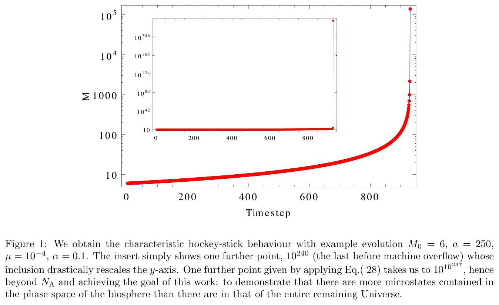

# Cortes_etal_BiocosmologyBirth_2022_Paper — Distillation

> Source: Marina Cortês, Stuart A. Kauffman, Andrew R. Liddle, and Lee Smolin, "Biocosmology: Towards the birth of a new science," Perimeter Institute / Instituto de Astrofísica / Institute for Systems Biology, April 2022, 35 pp. First in a series; companion papers: Paper 2 (Ref. [35]) and TAP equation paper (Ref. [55]).
> Date distilled: 2026-03-04
> Distilled by: Claude (via distill skill)
> Register: mixed (formal-mathematical + empirical cosmology + theoretical biology)
> Tone: mixed (impersonal-objective in formal sections; personal-reflexive in programmatic/speculative sections)
> Density: technical-specialist (assumes cosmology, statistical mechanics, quantum field theory, combinatorics)
> Source type: PDF
> Scan notes: 25/35 pages flagged as tables (false positives from academic formatting), 30 flagged as complex layout (two-column preprint), 3 equation pages detected by symbol presence only (inline math, not display)

## Core Argument

The paper asks whether the information contained in living systems — measured by the volume of their configuration space — can make a sizeable contribution to the information content of the Universe, potentially rivalling or exceeding the cosmological entropy bound $N_\Lambda = \exp(10^{124})$. The authors first inventory the Universe's known entropy contributions: material content ($S_\text{rel} \approx 10^{90}$), black holes ($S_\text{BH} \approx 3 \times 10^{104}$), and vacuum energy ($S_\Lambda \approx 3 \times 10^{122}$). They then argue that biology *must* lie outside the Newtonian paradigm because (a) the configuration space of living systems is ever-expanding through emergent bound states and (b) no fixed laws govern biological evolution in the way the Standard Model governs physics. This breaks the fundamental assumption underlying Boltzmann entropy: a fixed, prestated configuration space.

The argument's central move is to establish that emergent biological degrees of freedom are *equivalent* to fundamental degrees of freedom for the purpose of state-counting. This is not a philosophical assertion but follows from condensed matter physics precedent (Anderson, Laughlin, Leggett) where emergent phenomena are regarded as every bit as fundamental as elementary particle physics. If emergent DOF count, then the biological configuration space — generated by combinatorial innovation through the Theory of the Adjacent Possible — can grow super-exponentially. Three thought experiments demonstrate that hierarchical permutational construction yields numbers in the pattern $N_\text{resource-limited} \ll N_\Lambda \ll N_\text{comprehensive}$, but permutation alone cannot breach the holographic bound. Only the TAP equation's super-combinatorial growth — driven by the opacity principle (composites forget their origin and recombine freely) — achieves this.

Applied to the CHNOPS building blocks of Earth's biosphere with biologically-motivated parameters ($M_0 = 6$, $a = 250$, $\mu = 10^{-4}$, $\alpha = 0.1$), the TAP equation yields $N_\text{Bio}(t_\text{TS}) \sim 10^{10^{237}}$ by the time of template synthesis (~3.5 Gya), vastly exceeding $N_\Lambda \sim 10^{10^{120}}$. The paper closes with a speculation: the coincidence that dark energy came to dominate the cosmic energy budget at approximately the same epoch that RNA first appeared on Earth (~$z \approx 0.3$) might not be accidental.

## Key Concepts

| Concept | Definition | Significance |
|---------|-----------|--------------|
| Entropy inventory | Progressive accounting of cosmic entropy: material ($10^{90}$) → black holes ($10^{104}$) → vacuum ($10^{122}$) → biology (?) | Sets up the quantitative target that biology must exceed; each historical revision expanded the "price to be paid" at the Big Bang |
| Newtonian paradigm | Four assumptions: quantum-deterministic laws, trajectories in config space, fixed laws, fixed config space | The paper's central target — biology violates the fourth assumption (fixed config space), making Boltzmann entropy inapplicable |
| Ever-expanding configuration space | Living systems continuously generate new bound states, adding states to config space that did not previously exist | The mechanism that breaks the Newtonian paradigm; without this, biology stays within the holographic bound |
| No entailing laws | Biological evolution cannot be predicted by any fixed law; the only universal rule is "the name of the game is getting to exist" | Blocks the EFT strategy — there is no "Standard Model of biology" from which effective regimes could be derived |
| Emergent = fundamental DOF | Emergent composite degrees of freedom must be counted as equivalent to fundamental ones for thermodynamic state-counting | The conceptual bridge that allows biological complexity to inflate the entropy budget; supported by condensed matter precedent |
| EFT analogy | Physics has a sequence EFT1→EFT2→EFT3... (free particles → nuclei → atoms) all derivable from a single complete Hilbert space $H_\text{SM}$ | Biology has an analogous sequence (molecules → amino acids → proteins → cells → organisms) but with no underlying completion — the Hilbert space itself evolves |
| Opacity principle | When objects $a,b,c$ combine into composite $A = \{a,b,c\}$, $A$ "forgets" its origin and can recombine with $a$ or $b$ at the next step | The mechanism that produces super-combinatorial growth; without opacity, the problem is merely permutational |
| Holographic bound | $N_\Lambda = \exp(10^{124})$ — the maximum number of states within the observable Universe per the Bekenstein–Hawking area formula applied to the cosmic event horizon | The target number; comprehensive biological counts exceed it while resource-limited counts fall below it |
| Theory of the Adjacent Possible (TAP) | At any moment, the next evolutionary step is constrained to combinations of existing items but cannot be predicted in advance | The framework replacing the fixed configuration space; evolution expands through neighboring possibilities |
| TAP equation (constant-$\alpha$) | $M_{t+1} = M_t(1-\mu) + \alpha[2^{M_t} - M_t - 1]$ | The core dynamical equation; the $2^{M_t}$ term drives super-exponential growth (sum of Pascal's triangle row minus first two entries) |
| TAP equation (power-law $\alpha_i$) | $M_{t+1} = M_t(1-\mu) + \alpha a\left[(1+1/a)^{M_t} - M_t/a - 1\right]$ | The working equation used for CHNOPS simulation; parameter $a$ suppresses multi-element combinations |
| CHNOPS | Carbon–Hydrogen–Nitrogen–Oxygen–Phosphorus–Sulphur: the 6 chemical elements from which most biological molecules are constituted | $M_0 = 6$ initial elements for the TAP equation; the "elementary particles" of the biological simulation |
| Three thought experiments | (A) Simplified cell: $N_\text{genomes} = 20^{10^6} \approx 10^{10^6}$; (B) Multicellular: $N_\text{multicell biospheres} \approx 10^{3 \times 10^{27}}$; (C) Lego Star Wars: phase space degeneracy from snap-together composites | Demonstrate the pattern $N_\text{resource-limited} \ll N_\Lambda \ll N_\text{comprehensive}$ but also show that permutation alone cannot reach $N_\Lambda$ — only TAP can |
| Non-ergodicity | Living systems occupy a vanishingly sparse subset of their config space; e.g. $20^{200}$ possible 200-amino-acid chains but almost none actualized | Explains why biology operates far from equilibrium and why functional DOF vastly dominate fundamental DOF |
| Alive/Dead macrostates | Two-valued macroscopic observable $B_\alpha$: Alive (contains ≥1 living organism per Definition 2) or Dead (conventional cosmology) | The coarse-graining that separates the TAP regime from the conventional entropy calculation |
| Template synthesis ($t_\text{TS}$) | ~3.5 Gya: appearance of first RNA polymerase, enabling information storage and accurate replication | The epoch at which the TAP simulation is evaluated; chosen because it marks life's transition to open-ended evolution |
| Biological dark energy speculation | Dark energy came to dominate at $z \approx 0.30$; RNA appeared at $z \approx 0.33$ — a tighter coincidence than the usual "why now?" problem | Speculative but structurally placed: if biological information can modify vacuum energy, the coincidence problem acquires a biological dimension |
| Creative potential $Q$ | Information the Universe creates during evolution that is not present in initial conditions and not entailed by laws | Distinguishes the Newtonian paradigm ($Q^{NP} = 1$) from evolving-laws paradigms ($Q^{EL} \gg 1$); the Universe "learns" |

## Figures, Tables & Maps

### Figure 1: TAP equation hockey-stick growth

- **What it shows**: Log-scale plot of $M$ (number of microstates) vs timestep for parameters $M_0 = 6$, $a = 250$, $\mu = 10^{-4}$, $\alpha = 0.1$. Main plot shows slow growth for ~800 timesteps then explosive upturn. Inset shows one additional point at $10^{240}$ (last before machine overflow) that drastically rescales the y-axis, with gridlines at $10^{42}$, $10^{83}$, $10^{124}$, $10^{165}$, $10^{206}$.
- **Key data points**: Growth is flat (~6→~10) for 0–600 timesteps, then accelerates; last computable point $\approx 10^{240}$; one further analytic step via Eq. (28) yields $10^{10^{237}} \gg N_\Lambda \approx 10^{10^{120}}$
- **Connection to argument**: This is the central empirical result — the demonstration that CHNOPS-parameterized TAP exceeds the holographic bound well before the present epoch

## Figure ↔ Concept Contrast

- Figure 1 → **TAP equation (power-law $\alpha_i$)**: Direct visualization of Eq. (28) with biologically-motivated parameters
- Figure 1 → **Hockey-stick growth**: The characteristic TAP behavior — long dormancy followed by explosive blow-up at $t \sim \alpha^{-1}$
- Figure 1 → **Holographic bound**: The inset's $10^{124}$ gridline shows $N_\Lambda$ being surpassed; the analytic continuation to $10^{10^{237}}$ is the paper's central quantitative claim

## Equations & Formal Models

### Bekenstein–Hawking black hole entropy
$$S_\text{BH} = \frac{k_B G}{c\hbar}\,4\pi M^2 \tag{1}$$
- $S_\text{BH}$: black hole entropy (dimensionless in natural units)
- $M$: black hole mass
- Proportional to horizon area in Planck units; $S_\text{BH} = 3 \times 10^{104}$ integrated over cosmic black hole mass spectrum

### Vacuum entropy (de Sitter)
$$S_\Lambda = \frac{k_B c^3}{G\hbar}\,\frac{3\pi}{\Lambda} \approx 3 \times 10^{122} \tag{2}$$
- $\Lambda$: cosmological constant
- Corresponds to holographic bound; $N_\Lambda = \exp(10^{124})$ possible configurations in the observable Universe

### Possible genomes (thought experiment A)
$$N_\text{genomes} = 20^{10^6} \approx 10^{10^6} \tag{3}$$
- 20 amino acids, $10^3$ genes × $10^3$ triplets = $10^6$ amino acids per genome

### Imaginable biospheres
$$N_\text{imaginable biospheres} = 2^{N_\text{genomes}} \approx 10^{10^{10^6}} \tag{4}$$
- Power set of all possible genomes; vastly exceeds $N_\Lambda$ but most members cannot be physically realized

### Realizable biospheres
$$N_\text{realizable biospheres} = N_\text{genomes}^{10^7} \approx 10^{10^{13}} \tag{5}$$
- Resource-limited: $10^7$ species each drawn from the genome pool

### Resource-limitation pattern
$$N_\text{resource-limited} \ll N_\Lambda \ll N_\text{comprehensive} \tag{6}$$
- The recurring pattern across all thought experiments; key structural result

### TAP equation (general form)
$$M_{t+1} = M_t(1-\mu) + \sum_{i=2}^{M_t}\alpha_i\binom{M_t}{i} \tag{25}$$
- $M_t$: number of distinct types/states at time $t$
- $\alpha_i$: coupling constants (decreasing, suppressing multi-element combinations)
- $\mu$: extinction/obsolescence rate ($0 \leq \mu < 1$)
- Sum starts at $i=2$: separate objects must combine to innovate

### TAP equation (constant-$\alpha$ simplification)
$$M_{t+1} = M_t(1-\mu) + \alpha\left[2^{M_t} - M_t - 1\right] \tag{26}$$
- Uses identity: sum of combinatorials = $2^{M_t} - M_t - 1$ (Pascal's triangle row minus first two entries)
- For $\alpha=1$, $M_0=2$: sequence 2 → 3 → 7 → 127 → $2^{127}-1 \approx 10^{38}$ → $2^{10^{38}} \approx e^{10^{38}}$

### TAP equation (power-law $\alpha_i$ form)
$$M_{t+1} = M_t(1-\mu) + \alpha a\left[\left(1+\frac{1}{a}\right)^{M_t} - \frac{M_t}{a} - 1\right] \tag{28}$$
- $\alpha_i = \alpha/a^{i-1}$: power-law suppression of multi-element combinations
- $a$: suppression parameter (larger $a$ → stronger suppression of long chains; $a=1$ recovers Eq. 26)
- The working equation for CHNOPS simulation; $a=250$ favors proteins up to ~250 amino acids

### Central quantitative result
$$N_\Lambda(t_\text{TS}) \sim 10^{10^{120}} \ll N_\text{Bio}(t_\text{TS}) \sim 10^{10^{237}} \tag{29}$$
- At time of template synthesis ($t_\text{TS} \approx 3.5$ Gya), biological configuration space exceeds cosmological entropy bound

### Opacity and completeness relation
$$\mathbf{I} = |a\rangle\langle a| \oplus |b\rangle\langle b| \oplus |c\rangle\langle c| \oplus |\{a,b\}\rangle\langle\{a,b\}| \oplus |\{b,c\}\rangle\langle\{b,c\}| \oplus |\{a,c\}\rangle\langle\{a,c\}| \oplus |\{a,b,c\}\rangle\langle\{a,b,c\}| \tag{24}$$
- Composites and their components function as independent basis states in the effective low-energy Hilbert space
- Formalizes the opacity principle: $a$ inside $A = \{a,b,c\}$ is undetectable by low-energy experiment, so $a$ and $A$ are independent DOF

### Lego Star Wars Hilbert space
$$\mathcal{H}_\text{full} = \mathcal{H}_\text{deg} \otimes \mathcal{H}_\text{gapped}, \quad \dim(\mathcal{H}_\text{deg}) = M \times d_\text{toy} \tag{18–19}$$
- $M$: number of distinguishable toys constructible from the same $N$ pieces
- $d_\text{toy}$: DOF of a single assembled toy (= 6 for rigid body)
- Degenerate ungapped sector grows as $M$ grows; for $N = 10^8$ pieces and $M = 10^{1000}$ ways to assemble: $d_\text{deg} \approx (L/a)^{3 \times 10^{1000}}$

## Theoretical & Methodological Implications

The paper employs a mixed methodology: cosmological entropy accounting (standard Boltzmann/Bekenstein framework), combinatorial mathematics (Pascal's triangle identities, power-law summation), thought-experiment reasoning (three progressively complex biological systems), and numerical simulation (TAP equation with biologically-calibrated parameters). The authors are explicit that they are constructing a *lower bound* on $N_\text{Bio}$ — every simplification (two macrostates, CHNOPS-only, single TAP form, high extinction rate) is designed to undercount.

The key methodological move is the EFT analogy: physics counts states by knowing the completion (the Standard Model), from which all effective regimes derive. Biology has no completion — the Hilbert space itself evolves. Therefore the paper's method is phenomenological rather than derivational: it uses TAP as a model for the *rate* of configuration space growth rather than attempting to enumerate specific states. This is a deliberate inversion of the standard physics approach.

The paper's scope is carefully circumscribed: the authors do not claim to have proven that $N_\text{Bio} > N_\Lambda$, but rather that the evidence is "many-fold and strong" and that the possibility "merits further exploration." The biological dark energy speculation (Section 10) is explicitly flagged as "certainly outrageous, yet in some ways compelling." The four authors hold divergent views on reductionism vs. emergence but agree on the denial of the Newtonian paradigm as sufficient for biology — a methodologically unusual disclosure that strengthens the argument by making its minimal commitments explicit.
