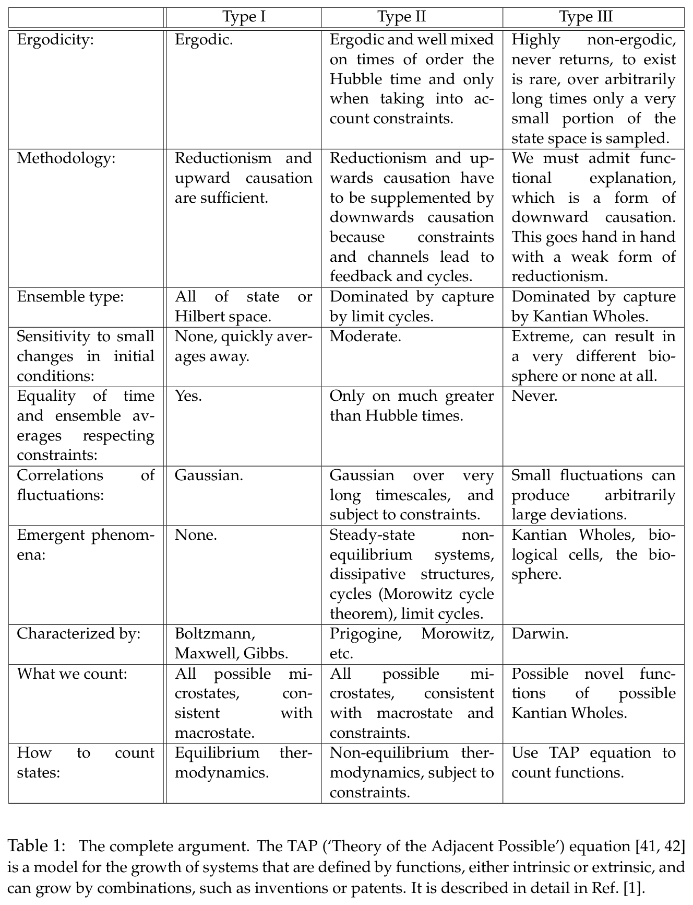

# Cortes_etal_BiocosmologyPerspective_2022_Paper — Distillation

> Source: Cortês, Kauffman, Liddle & Smolin, "Biocosmology: Biology from a cosmological perspective," April 2022, 28 pp.
> Date distilled: 2026-03-04
> Distilled by: Claude (via distill skill)
> Register: mixed (formal-mathematical + philosophical + empirical cosmology)
> Tone: impersonal-objective
> Density: technical-specialist (presumes statistical mechanics, cosmology, philosophy of science)
> Source type: PDF
> Scan notes: 12/28 table flags, 24/28 complex layout flags — all false positives from academic two-column formatting. Route A (clean text) throughout.

## Core Argument

The paper asks whether the laws of physics give adequate foundations for a complete explanation of biological phenomena, and answers: *necessary but not sufficient*. The argument proceeds through a three-type classification of cosmological statistical systems based on the ratio of thermalization time to the Hubble timescale. Type I systems (ergodic, fast equilibration) and Type II systems (Hubble-timescale equilibration under constraints) both eventually reach equilibrium — they differ only in how long it takes. Type III systems *never* reach equilibrium while alive: their state spaces are so vast that the Universe in its entire spacetime volume cannot populate more than a vanishing fraction of possible states.

The classification does not merely describe; it *prescribes* distinct explanatory methodologies. Type I admits standard reductionism. Type II requires supplementation with downward causation (constraints, feedback, cycles). Type III demands *functional explanations* — a fundamentally different kind of account that says X exists because X contributes to the survival of a larger whole. The paper's central methodological claim is that adequate explanation of a universe containing life requires both reductionist (bottom-up) and functional (top-down) explanatory modes operating simultaneously. Neither alone suffices; both are necessary and mutually compatible.

The BBN paradox resolution performs critical bridging work: it demonstrates that even within physics, apparent thermodynamic paradoxes dissolve when all relevant interactions are properly included in the entropy calculation. This sets up the Type III argument by structural analogy — if we neglect functional explanations in biology, we produce analogous pseudo-paradoxes (why does this protein exist while ~20^{1000} others don't?). The concept of *false equilibrium* — equilibrium calculated from an incomplete theory — is the hinge on which the entire argument turns: systems appearing stable may simply be in a regime where decisive interactions haven't yet "switched on."

The boldest move is the proposed fourth law: in Type III systems, the number of possible functions $F_P$, actual functions $F_A$, and their ratio $R = F_P/F_A$ all tend to increase — with $F_P$ growing at tetration rate. This gives the classification teeth beyond taxonomy: Type III systems don't merely persist far from equilibrium, they *systematically expand their functional repertoire* faster than any exponential.

## Key Concepts

| Concept | Definition | Significance |
|---------|-----------|-------------|
| Type I system | Statistical system with $t_{\text{equil}} \ll t_H$; satisfies Boltzmann's ergodic hypothesis; standard equilibrium thermodynamics applies | Baseline category: what physics already explains well. Establishes that the early Universe was Type I — the starting condition from which the argument departs |
| Type II system | System with $t_{\text{eq-con}} \gg t_H$; approaches equilibrium subject to constraints but takes longer than Hubble time | Intermediate category: shows that Hubble-timescale phenomena (stars, galaxies, dissipative structures) are already non-trivial but still eventually equilibrate. Bridges to Type III |
| Type III system | Interacting thermodynamic system that never reaches equilibrium while alive; state space so vast that $N_Q \gg N_p \sim 10^{80}$ | Central category of the paper: enables the argument that new explanatory methods (functional explanation) are *required*, not merely useful. Existence is rare; most possible configurations never realized |
| Thermalization time $t_{\text{thermal}}$ | Time for a system to return to stable/metastable equilibrium after order-unity perturbation | The classifying variable: its ratio to $t_H$ determines system type and thereby the appropriate explanatory methodology |
| False equilibrium | Equilibrium state computed from incomplete theory — excludes interactions that are present but inoperative at current conditions | Resolves the BBN paradox and provides the conceptual device for understanding how apparently stable systems mask deeper dynamics. Analogous to false vacuum in field theory |
| Entropy as non-observable | Entropy is a function of the observer's knowledge of the system, not a measurable property of the state; depends on which interactions are included in the calculation | Epistemological principle that makes the false equilibrium resolution work. Demonstrates via cosmological entropy history ($S_{\text{rel}} \sim 10^{90} \to S_{BH} \sim 10^{104} \to S_\Lambda \sim 10^{124}$) that entropy estimates revise when new interactions are recognized |
| Functional explanation | X exists because X contributes to the survival or well-being of a larger system S; what X does for S is its function | The paper's methodological conclusion: the *only* kind of explanation that can fill the gap left by reductionism in Type III systems. Requires downward causation |
| Kantian Whole | A system where the Parts exist in the Universe *for and by means of* the Whole; interconnected subprocesses $P_I$ perform functions that increase fitness of Whole $K$ | Formalizes functional explanation into a precise structural concept. Enables hierarchical organization (Kantian Wholes within Kantian Wholes). Makes "good for K" a meaningful predicate |
| Downward causation | The whole explains the existence of its parts (the heart exists because the cat exists), not merely the reverse | Bridges functional and reductionist explanation, making them compatible rather than contradictory. In biology, upward and downward causation are both present and necessarily so |
| Recursive property | Type III system has a code providing complete mapping from nucleic acid chains to catalytic functionalities — self-referential storage of structural information | Captures how Type III systems *know themselves* — maintain identity through coding. The explicit self-reference that enables self-construction |
| Excursive property | The same coding that enables self-construction can be altered to code any of a vast space of alternatives — implicit reference to adjacent possibilities | Captures how Type III systems *exceed themselves* — the coding refers implicitly to alternatives not yet realized. Paired with recursive: one system, two directions (inward/outward) |
| Three arrows of dynamics | Type I: temporary, time-reversal symmetric, decoupled from cosmology. Type II: cosmological-timescale, coupled to expansion. Type III: irreversible, indefinite, continues as long as energy source persists | Differentiates the temporal structure of each system type. The Type III arrow raises the question whether fundamental laws must be time-irreversible |
| Fourth law of thermodynamics | For any Type III system: $F_P$, $F_A$, and $R = F_P/F_A$ all tend to increase while non-equilibrium conditions persist | The paper's boldest claim: Type III systems don't merely persist — they systematically expand their functional space. $F_P$ grows at tetration rate (super-exponential). Not a violation of the second law; total entropy still increases when energy source is included |
| Constraint closure | The set of constraints constrains energy release in non-equilibrium processes that construct the very same set of constraints | Key mechanism for how living systems self-construct. Work requires constraints; work can construct constraints; in living cells this closes into a self-sustaining loop |
| Negative specific heat | Gravitationally-bound systems heat up when energy is removed | Explains why stars (Type II) take so long to equilibrate: combined with the landscape of nuclear bound states, creates a web of metastable states sequestering nuclear potential energy far beyond naive nuclear timescales |
| Definition of life | A Kantian Whole within a Type III system that is a non-equilibrium self-reproducing system with metabolism, identity, boundary, capable of open-ended evolution by heritable variation and selection or drift | Synthesizes the entire argument into a single definition. Every component maps to a specific element of the preceding theoretical development |

## Figures, Tables & Maps

### Table 1: The Complete Argument — Comparison of Type I, II, III Systems

- **What it shows**: 10-row comparison matrix contrasting Type I, II, and III systems across: ergodicity, methodology, ensemble type, sensitivity to initial conditions, time/ensemble average equality, correlations of fluctuations, emergent phenomena, characterized by (key thinkers), what we count, and how to count states
- **Key data points**: Type I → Boltzmann/Maxwell/Gibbs, equilibrium thermodynamics. Type II → Prigogine/Morowitz, non-equilibrium thermodynamics subject to constraints. Type III → Darwin, use TAP equation to count functions. The "How to count states" row explicitly names the TAP equation as the appropriate tool for Type III
- **Connection to argument**: This is the paper's summary artifact — the complete argument compressed into a single visual. The progression across columns traces the paper's central logic: from standard physics (Type I) through augmented physics (Type II) to the hybrid methodology the paper advocates (Type III)

## Figure ↔ Concept Contrast

- Table 1 → Type I/II/III classification: directly displays the full taxonomy across 10 dimensions
- Table 1 → Functional explanation: the "Methodology" row shows functional explanation as the distinguishing methodological requirement of Type III
- Table 1 → Kantian Whole: appears in "Ensemble type" (dominated by capture by Kantian Wholes) and "Emergent phenomena" (Kantian Wholes, biological cells, the biosphere)
- Table 1 → Fourth law / TAP equation: the "How to count states" row names the TAP equation as Type III's counting method — the formal connection to the companion paper [1]
- Table 1 → Downward causation: shown in "Methodology" for both Type II (supplemented) and Type III (necessary)
- Table 1 → Three arrows of dynamics: implicit in the ergodicity and time/ensemble average rows, which trace the temporal structure across types

## Equations & Formal Models

### Metastable Equilibrium Condition
$$t_{\text{eq-con}} \ll t_{\text{constraints}} \tag{1}$$
- $t_{\text{eq-con}}$: time to evolve to equilibrium on the constrained subset of states (scalar, years)
- $t_{\text{constraints}}$: timescale over which constraints hold (scalar, years)
- When satisfied, the system behaves like an ordinary equilibrium system on intermediate timescales

### Hubble Timescale
$$t_H \equiv H^{-1}, \quad H \equiv \frac{\dot{a}}{a} \tag{2}$$
- $t_H$: Hubble time (scalar, ~14.5 Gyr currently); proxy for age of Universe (13.8 Gyr)
- $H$: Hubble parameter (scalar, s$^{-1}$)
- $a$: cosmological scale factor (dimensionless)

### Type II Definition
$$t_{\text{eq-con}} \gg t_H \tag{3}$$
- System approaches equilibrium subject to constraints but takes longer than Hubble time
- Includes stars, galaxies, dissipative systems, autocatalytic networks

### Fourth Law Formalism
$$R = \frac{F_P}{F_A} \tag{4}$$
- $F_A$: number of distinct actual functions used by Type III system $\mathcal{T}$ at time $t$ (integer)
- $F_P$: number of possible functions — presently unexpressed codons + achievable through few mutations (integer)
- $R$: ratio of possible to actual functions (dimensionless, >1 in Type III)

**The conjectured fourth law:**
$$F_P, \; F_A, \; \text{and } R \text{ all have a tendency to increase} \tag{5}$$
- Holds for any Type III system while non-equilibrium conditions persist
- $F_P$ grows at tetration rate (super-exponential)
- Not a violation of second law — total entropy increases when energy source included

### Thermalization Ratio
$$r = \frac{t_{\text{thermal}}}{t_H} \tag{6}$$
- $r$: ratio of thermalization time to Hubble time (dimensionless)
- Type I: $r \ll 1$. Type II: $r \gtrsim 1$ (Eq. 7). Type III: $r$ undefined (no thermalization time)

### Type III Condition
$$N_Q \gg N_p \sim 10^{80} \tag{8}$$
- $N_Q$: number of alternative versions of subsystem $Q$ (integer, continually increasing)
- $N_p$: number of protons within Hubble distance (~$10^{80}$)
- Example: $N_{\text{protein}} \sim 20^{1000} \gg 10^{80}$ (Eq. 9) — possible proteins vastly exceed baryonic content

## Theoretical & Methodological Implications

**Method**: The paper employs a classification-driven philosophical argument grounded in statistical thermodynamics, supplemented by cosmological reasoning and biological examples. It is not empirical (no new data) nor purely formal (no new mathematical results beyond the fourth law conjecture). The method is *methodological*: it argues about what kinds of explanations are required, not about what the explanations are.

**Key methodological assumptions**:
1. Statistical thermodynamics is the correct framework for situating macroscopic subsystems of the Universe
2. The best explanations are both sufficient and complete in Leibniz's sense (why P rather than NOT-P)
3. The Hilbert space is microscopically complete — all states exist in the full theory even when unoccupied
4. The TAP equation (from companion paper [1]) is the appropriate counting method for Type III functions

**What the method precludes**: The paper explicitly rejects that deterministic integration from initial conditions can explain Type III phenomena — even in principle (quantum randomness of mutations, computational limits, extreme sensitivity). It also rejects purely functional explanations as sufficient — both reductionist and functional are required.

**Multiverse objection**: The paper notes that if one posits enough copies of a Type III system in a multiverse, standard microcanonical arguments might apply. But this *proves their point*: the applicable methodology depends on cosmological assumptions. Biology and cosmology are coupled.

**Relationship to companion papers**: This is the second in a series. Paper 1 (BiocosmologyBirth) introduces the TAP equation and develops the numerical treatment showing tetration growth. This paper provides the philosophical and physical framework that motivates the TAP equation's application. The TAP equation itself is described in a separate dedicated paper [42].
