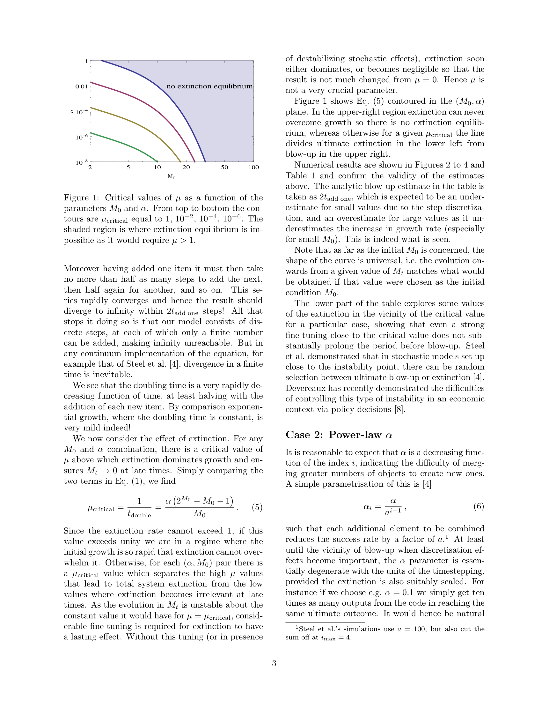
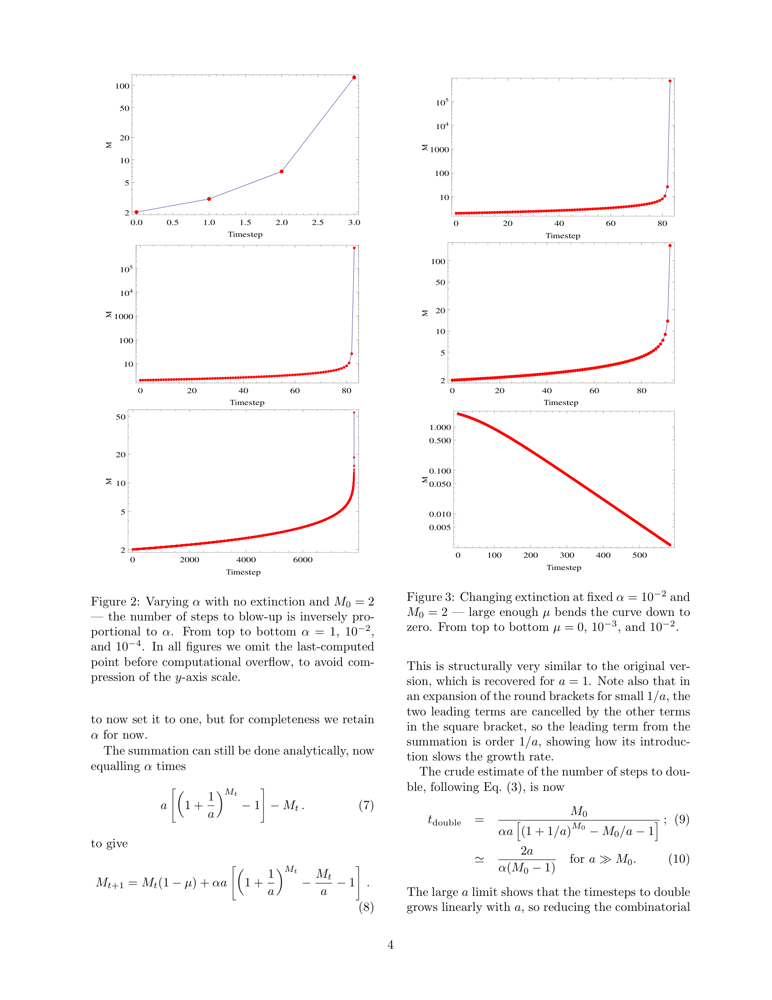
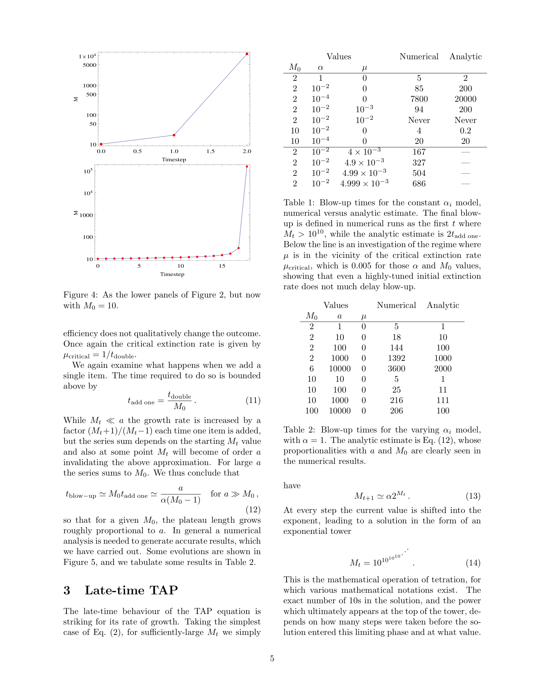
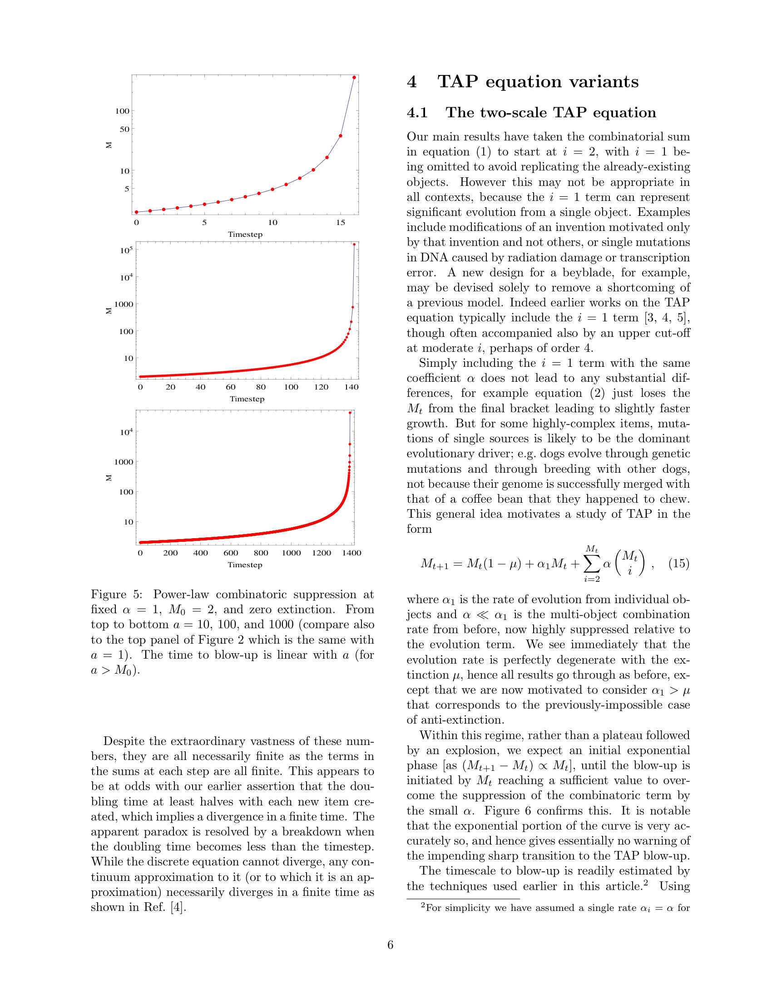
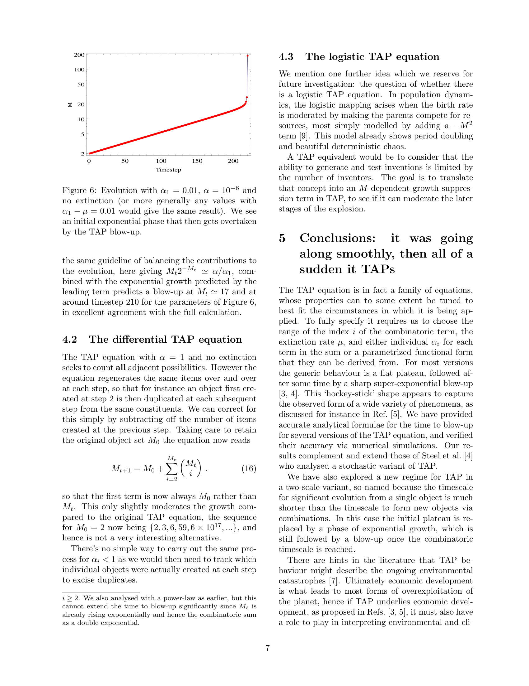

# Cortes_etal_TAPEquation_2022_Paper — Distillation

> Source: Cortês, Kauffman, Liddle & Smolin, "The TAP equation: evaluating combinatorial innovation [in biocosmology]", arXiv:2204.14115v4 [q-bio.PE], April 2022 (preprint, 8pp) / October 2025 (published, 10pp). Perimeter Institute / Instituto de Astrofísica / Institute for Systems Biology.
> Date distilled: 2026-03-04 (re-distillation — replaces pre-skill version)
> Distilled by: Claude (via distill skill)
> Register: formal-mathematical
> Tone: impersonal-objective
> Density: technical-specialist
> Source type: PDF (two versions: 2022 preprint + 2025 published)
> Scan notes: Tables/complex-layout flags are false positives (two-column academic layout). Equation flags detected by symbol presence — all equations are inline/display LaTeX, not image-encoded. Figures extracted as full-page renders (caption-only crops failed due to two-column vector encoding).

## Core Argument

The paper establishes the TAP equation as a *family* of parametric recurrences governing combinatorial innovation — the process by which new objects arise from combinations of existing ones. The central formal move derives analytic blow-up time estimates for each variant by exploiting a recursive acceleration argument: adding one new object at least doubles the accessible option space (substitutability), so the doubling time halves geometrically, producing finite-time convergence of the series — i.e., blow-up in finite time. This argument is the paper's sharpest technical contribution, yielding $t_\text{blow-up} \approx 2 \cdot t_\text{add one}$ (constant $\alpha$) and $t_\text{blow-up} \approx a/[\alpha(M_0 - 1)]$ (power-law $\alpha$).

Three structural results follow: (1) extinction equilibrium is *unstable* — the critical extinction rate $\mu_\text{critical}$ creates a knife-edge where fine-tuning delays blow-up only marginally, so extinction is either total or irrelevant; (2) the curve shape is *universal* with respect to initial conditions (evolution from any $M_t$ is identical to starting fresh at $M_0 = M_t$); (3) the transition to blow-up is *unforeshadowable* — no feature of the pre-blow-up curve predicts the onset. The two-scale variant strengthens this last point: exponential pre-blow-up growth (driven by single-object evolution $\alpha_1 M_t$) is "very accurately" exponential, giving "essentially no warning" of the impending combinatoric takeover.

The published version (2025) adds a continuous formulation via blow-up integral $t_\text{blow-up} = \int_{M_0}^\infty dM/F[M]$, which rigorously establishes finite-time divergence for any continuous approximation. The integral gives $t_\text{blow-up} \approx 1381$ for a test case where the discrete model yields 1392 — confirming the continuous formulation's fidelity.

## Key Concepts

| Concept | Definition | Significance |
|---------|-----------|--------------|
| TAP equation | $M_{t+1} = M_t(1-\mu) + \sum_{i=2}^{M_t} \alpha_i \binom{M_t}{i}$ — discrete recurrence for combinatorial innovation | The foundational structure: counts ways new objects arise from combinations of existing ones. All variants are parametric specializations of this form. |
| Adjacent Possible | The set of objects reachable by combining existing objects at the next timestep | Provides the *ontological claim* behind the equation: the future is constrained by, but exceeds, the present. The combinatoric sum operationalizes this. |
| Blow-up | Effective divergence of $M_t$ to infinity in finite time | The paper's central phenomenon. Not literal divergence (discrete steps keep every term finite) but operational divergence — doubling time falls below timestep resolution. |
| $t_\text{add one}$ | Time to add one new item: $1/[\alpha(2^{M_0} - M_0 - 1)]$ (constant $\alpha$) | The paper's key analytic device. One new item → at least doubles rate → geometric halving of subsequent add-one times → finite convergence. |
| Hockey-stick dynamics | Extended plateau → sudden super-exponential blow-up | The characteristic TAP signature. The plateau length is analytically estimable; the blow-up onset is not detectable from within the plateau phase. |
| Extinction instability | $\mu_\text{critical} = \alpha(2^{M_0} - M_0 - 1)/M_0$; equilibrium is unstable | Blocks any stable coexistence of innovation and extinction. The system is structurally binary: total extinction or total blow-up. Fine-tuning delays blow-up only marginally (Table 1). |
| Constant $\alpha$ case | $\alpha_i = \alpha$ → $M_{t+1} = M_t(1-\mu) + \alpha(2^{M_t} - M_t - 1)$ | Base $2^M$ growth. Pascal's triangle reduction. Produces tetration at late times. The analytically simplest case. |
| Power-law $\alpha$ case | $\alpha_i = \alpha/a^{i-1}$ → base $(1+1/a)^M$ growth | Slows growth by factor $a$ without changing qualitative outcome. $t_\text{blow-up} \propto a$ (linear stretch). The case most relevant to real-world applications. |
| Tetration | Late-time: $M_{t+1} \approx \alpha \cdot 2^{M_t}$ → exponential tower $10^{10^{10^{\cdots}}}$ | Characterizes the *kind* of infinity TAP approaches: each step shifts the value into the exponent. Vastly exceeds any fixed exponential or polynomial. |
| Universality | Evolution from $M_t$ ≡ evolution from $M_0 = M_t$ | The curve shape is history-independent — Markov property of the bare equation. Pre-blow-up history is irrelevant to subsequent dynamics. |
| Two-scale TAP | $M_{t+1} = M_t(1-\mu) + \alpha_1 M_t + \sum \alpha \binom{M_t}{i}$, with $\alpha_1 \gg \alpha$ | Replaces plateau with exponential phase. $\alpha_1$ is degenerate with $\mu$ → "anti-extinction." Exponential-to-blow-up transition is undetectable from within. |
| Differential TAP | $M_{t+1} = M_0 + \sum \binom{M_t}{i}$ — subtracts previous step's duplicates | Only slightly moderates growth. Not tractable for $\alpha_i < 1$. A conceptual variant rather than a practical one. |
| Logistic TAP | Add $-M^2$ suppression (resource competition among inventors) | Proposed but *unsolved*. The paper identifies this as the key open problem: can combinatorial blow-up be moderated by finite resources? |
| Continuous blow-up integral | $t_\text{blow-up} = \int_{M_0}^\infty dM/F[M]$ where $F[M]$ is the continuous evolution function | Makes blow-up rigorous: for sufficiently rapidly growing $F$, integral converges → finite-time divergence. Also interpretable as the time beyond which discrete timestepping loses viability. |
| Stochastic vs deterministic | Steel et al.'s stochastic model ≠ discretization of TAP itself — it discretizes a *continuum approximation* | Clarifies that deterministic TAP and stochastic TAP are not equivalent: nonlinearity means even the mean stochastic behavior departs from deterministic evolution. |

## Figures, Tables & Maps

### Figure 1: Critical extinction values μ_critical

- **What it shows**: Contour plot of $\mu_\text{critical}$ in the $(M_0, \alpha)$ plane. Log-log axes: $M_0 \in [2, 100]$, $\alpha \in [10^{-8}, 1]$. Contours from top to bottom: $\mu_\text{critical} = 1, 10^{-2}, 10^{-4}, 10^{-6}$.
- **Key data points**: Shaded upper-right region = "no extinction equilibrium" (would require $\mu > 1$). Below/left of each contour: extinction dominates. Above/right: blow-up dominates.
- **Connection to argument**: Demonstrates the structural binary — for any $(M_0, \alpha)$ pair, the system is either blow-up-destined or extinction-destined, with an unstable knife-edge between.

### Figures 2–4: Evolution curves (constant α)

- **What it shows**: Six panels. **Figure 2** (left column, 3 panels): $M$ vs timestep for $M_0 = 2$, $\mu = 0$, $\alpha = 1, 10^{-2}, 10^{-4}$ (top to bottom). Log-scale $M$ axis. **Figure 3** (right column, 3 panels): $M$ vs timestep for $\alpha = 10^{-2}$, $M_0 = 2$, $\mu = 0, 10^{-3}, 10^{-2}$ (top to bottom).
- **Key data points**: Figure 2: blow-up at $t \approx 5, 85, 7800$ — inversely proportional to $\alpha$. Figure 3: $\mu = 10^{-2}$ (= $\mu_\text{critical}$) → extinction to zero; $\mu = 10^{-3}$ → slightly delayed blow-up.
- **Connection to argument**: Validates $t_\text{blow-up} \propto 1/\alpha$ and demonstrates extinction instability visually — the $\mu = 10^{-3}$ curve (sub-critical) shows almost no delay vs $\mu = 0$.

### Figure 4 & Tables 1–2: Blow-up times

- **What it shows**: **Figure 4** (left, 2 panels): Same as Figure 2 lower panels but with $M_0 = 10$. **Table 1** (right-top): Numerical vs analytic ($2 t_\text{add one}$) blow-up times for constant $\alpha_i$ model. Lower rows: fine-tuned $\mu$ near $\mu_\text{critical} = 0.005$. **Table 2** (right-bottom): Blow-up times for power-law $\alpha_i$ with $\alpha = 1$.
- **Key data points (Table 1)**: $(M_0, \alpha, \mu) = (2, 1, 0)$: numerical=5, analytic=2 | $(2, 10^{-2}, 0)$: 85 vs 200 | $(10, 10^{-2}, 0)$: 4 vs 0.2. Fine-tuning: $\mu = 4.999 \times 10^{-3}$ (≈$\mu_\text{critical}$) → blow-up at 686 (only ~8× delay vs $\mu = 0$).
- **Key data points (Table 2)**: $(M_0, a) = (2, 10)$: 18 vs 10 | $(2, 1000)$: 1392 vs 1000 | $(10, 10)$: 5 vs 1. $t_\text{blow-up} \propto a$ clearly visible.
- **Connection to argument**: Tables validate analytic estimates (correct order-of-magnitude). Fine-tuning section proves extinction does not significantly delay blow-up.

### Figure 5: Power-law combinatoric suppression

- **What it shows**: Three panels: $M$ vs timestep for $\alpha = 1$, $M_0 = 2$, $\mu = 0$, $a = 10, 100, 1000$ (top to bottom). Log-scale $M$ axis.
- **Key data points**: Blow-up at $t \approx 18, 144, 1392$ — linear with $a$. Same hockey-stick shape regardless of $a$.
- **Connection to argument**: Demonstrates that combinatorial suppression (increasing $a$) stretches the plateau proportionally but preserves the qualitative outcome — blow-up is inevitable.

### Figure 6: Two-scale TAP evolution

- **What it shows**: $M$ vs timestep for $\alpha_1 = 0.01$, $\alpha = 10^{-6}$, $\mu = 0$. Log-scale $M$ axis. Clear exponential phase (linear on log plot) → sharp transition to TAP blow-up at $t \approx 210$.
- **Key data points**: Exponential phase: $M$ grows from 2 to ~17 with constant doubling time. Blow-up onset at $M_t \approx 17$ (where $M_t 2^{-M_t} \approx \alpha/\alpha_1$). Predicted blow-up at $t \approx 210$ — matches computation.
- **Connection to argument**: The exponential phase is *indistinguishable from simple exponential growth* — the combinatoric blow-up gives no advance warning. This is the paper's most practically concerning result.

## Figure ↔ Concept Contrast

- Figure 1 → Extinction instability: visualizes the $(M_0, \alpha)$ phase space and the unstable boundary
- Figure 2 → Constant α case, $t_\text{blow-up} \propto 1/\alpha$: validates the analytic blow-up time estimate
- Figure 3 → Extinction instability: shows fine-tuned μ barely delays blow-up
- Figure 4 → Universality: $M_0 = 10$ produces same shape as $M_0 = 2$, just faster
- Table 1 → $t_\text{add one}$, Extinction instability: quantifies blow-up time accuracy and fine-tuning futility
- Table 2 → Power-law α case: validates $t_\text{blow-up} \propto a$
- Figure 5 → Power-law α case: visualizes $a$-linear plateau stretching without qualitative change
- Figure 6 → Two-scale TAP: demonstrates exponential→blow-up transition and unforeshadowability

## Equations & Formal Models

### TAP equation (fundamental form)
$$M_{t+1} = M_t(1-\mu) + \sum_{i=2}^{M_t} \alpha_i \binom{M_t}{i} \tag{1}$$
- $M_t$: number of distinct object types at time $t$ (scalar, integer or analytic continuation)
- $\alpha_i$: efficiency parameter for $i$-element combinations (dimensionless, $0 < \alpha_i \leq 1$)
- $\mu$: extinction rate ($0 \leq \mu < 1$, fraction of objects lost per timestep)
- $\binom{M_t}{i}$: binomial coefficient — number of ways to choose $i$ objects from $M_t$

### Constant α reduction
$$M_{t+1} = M_t(1-\mu) + \alpha(2^{M_t} - M_t - 1) \tag{2}$$
- Sum of Pascal's triangle row minus first two entries = $2^{M_t} - M_t - 1$

### Doubling time (constant α)
$$t_\text{double} = \frac{M_0}{\alpha(2^{M_0} - M_0 - 1)} \tag{3}$$

### Add-one time (constant α)
$$t_\text{add one} = \frac{1}{\alpha(2^{M_0} - M_0 - 1)} \tag{4}$$

### Critical extinction rate
$$\mu_\text{critical} = \frac{1}{t_\text{double}} = \frac{\alpha(2^{M_0} - M_0 - 1)}{M_0} \tag{5}$$

### Power-law α parametrization
$$\alpha_i = \frac{\alpha}{a^{i-1}} \tag{6}$$
- $a$: suppression factor per additional element (dimensionless, $a \geq 1$)

### Power-law summation
$$\text{Sum} = \alpha a\left[\left(1 + \frac{1}{a}\right)^{M_t} - 1\right] - M_t \tag{7}$$

### Power-law TAP equation
$$M_{t+1} = M_t(1-\mu) + \alpha a \left[\left(1 + \frac{1}{a}\right)^{M_t} - \frac{M_t}{a} - 1\right] \tag{8}$$

### Power-law doubling time
$$t_\text{double} \approx \frac{M_0}{\alpha a[(1+1/a)^{M_0} - M_0/a - 1]} \approx \frac{2a}{\alpha(M_0-1)} \quad \text{for } a \gg M_0 \tag{9-10}$$

### Power-law add-one time
$$t_\text{add one} \approx \frac{t_\text{double}}{M_0} \tag{11}$$

### Power-law blow-up time
$$t_\text{blow-up} \approx M_0 \cdot t_\text{add one} \approx \frac{a}{\alpha(M_0-1)} \quad \text{for } a \gg M_0 \tag{12}$$

### Late-time approximation (tetration regime)
$$M_{t+1} \approx \alpha \cdot 2^{M_t} \tag{13}$$

### Exponential tower (tetration)
$$M_t = 10^{10^{10^{10^{\cdots}}}} \tag{14}$$

### Two-scale TAP equation
$$M_{t+1} = M_t(1-\mu) + \alpha_1 M_t + \sum_{i=2}^{M_t} \alpha \binom{M_t}{i} \tag{15}$$
- $\alpha_1$: single-object evolution rate ($\alpha_1 \gg \alpha$)
- $\alpha_1$ is perfectly degenerate with $\mu$: effective extinction = $\mu - \alpha_1$

### Continuous blow-up formulation (published version)
$$\frac{dM(t)}{dt} = F[M] \tag{15'}$$
$$t_\text{blow-up} = \int_{M_0}^{\infty} \frac{dM}{F[M]} \tag{16'}$$
- $F[M]$: analytically-continued evolution function (e.g., RHS of Eq. 8 for power-law case)
- Integral converges for any sufficiently rapidly growing $F$ → finite-time blow-up is rigorously established

### Differential TAP equation
$$M_{t+1} = M_0 + \sum_{i=2}^{M_t} \binom{M_t}{i} \tag{16}$$
- Corrects for regeneration of same items. Sequence: $\{2, 3, 6, 59, 6 \times 10^{17}, \ldots\}$

**Note on equation numbering**: The 2022 preprint numbers Eqs (1)–(16). The 2025 published version renumbers starting at Section 4: the continuous blow-up equations are (15)–(16) in that version, while the two-scale TAP is (17) and differential TAP is (18). Above, primed numbers (15′, 16′) distinguish the continuous formulation from the preprint numbering.

## Theoretical & Methodological Implications

**Method**: Analytic mathematics (closed-form summation, asymptotic analysis, geometric series convergence arguments) validated against deterministic numerical simulation. The paper explicitly distinguishes its deterministic treatment from Steel et al.'s stochastic approach, noting that nonlinearity breaks the equivalence between mean stochastic and deterministic evolution.

**The substitutability argument** (the add-one-item insight) is the paper's key methodological move: rather than tracking full system evolution, it bounds the blow-up time by analyzing the *marginal* dynamics of a single new item. This transforms a nonlinear recurrence problem into a geometric series convergence problem.

**Boundary conditions**: The analysis assumes (a) no spatial structure, (b) no resource constraints on combination attempts, (c) perfect mixing (any $i$ objects can be combined), (d) time-invariant parameters. All four are relaxed in various extensions (stochastic models, the logistic TAP proposal, and agent-based implementations).

**What the method precludes**: The purely mathematical treatment cannot address *what the objects are* or *why certain combinations succeed*. The $\alpha_i$ parameters encode this information externally. The paper explicitly notes that the logistic variant (resource-limited TAP) remains unsolved — the method of analytic summation breaks down when growth depends on current state in a non-combinatoric way.

**Implicit ontological commitment**: The TAP equation treats objects as featureless counters distinguished only by number. All combinatorial possibilities are enumerated; the $\alpha_i$ filter which fraction are realized. This is a maximally abstract model of innovation — it captures the *rate* of novelty production without modeling the *content* of novelty.

## Applied Contexts

The paper and its published version connect TAP dynamics to empirical domains:
- GDP per capita growth, manufactured goods diversity, US patent family trees (Koppl et al.)
- The Great Acceleration (Steffen et al. 2015) — environmental/climatic hockey-stick indicators
- Technological Singularity (Vinge 1993, Kurzweil 2006/2024) — TAP as mathematical substrate
- Macroevolutionary singularities (Bellina et al. 2024)
- Economic policy limitations under TAP-type instability (Devereaux 2021)

The concluding argument: if TAP underlies economic development, and economic development drives environmental exploitation, then environmental indicators should exhibit hockey-stick dynamics with unforeshadowable blow-up — with implications for species survival on the timescale of decades.
