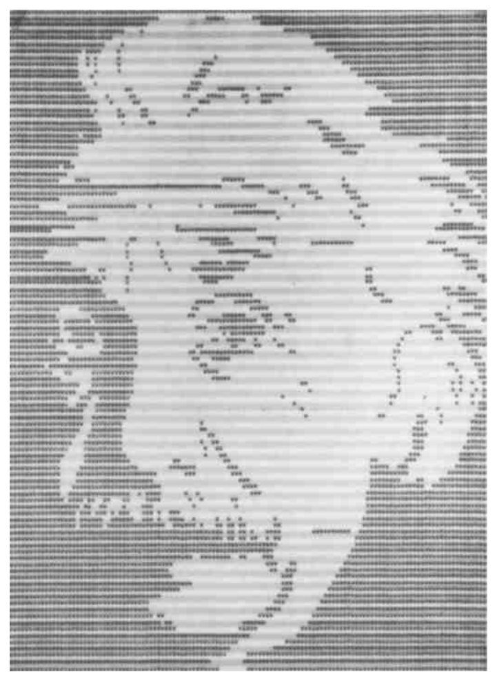

# Deleuze_Guattari_ATPCh15_1987_Chapter — Distillation

> Source: Gilles Deleuze & Félix Guattari, *A Thousand Plateaus: Capitalism and Schizophrenia*, trans. Brian Massumi (Minneapolis: University of Minnesota Press, 1987), Chapter 15: "Conclusion: Concrete Rules and Abstract Machines," pp. 501–514. 14 pages.
> Date distilled: 2026-03-02
> Distilled by: Claude (via distill skill)
> Register: continental / post-structuralist
> Tone: impersonal-objective (theoretical third person, declarative)
> Density: technical-specialist (requires familiarity with D&G's conceptual apparatus; this chapter recapitulates the entire work)

## Core Argument

Chapter 15 is a recapitulation of the entire conceptual apparatus of *A Thousand Plateaus*, organized through six lettered entries (S/A/R/C/D/M) that together describe a unified ontology of how reality is organized, how entities operate within that organization, and how transformation occurs.

The argument proceeds through nested scales. **Strata** (S) are the primary organizational principle — phenomena of thickening, accumulation, and coding that create ordered reality from chaos. Every stratum exhibits *double articulation*: what is articulated is always a **content** (pragmatic, material) and an **expression** (semiotic, signifying), which are really distinct from each other even though form and substance are not. The distribution of content/expression varies across strata (linearization on organic strata, superlinearity on anthropomorphic strata), creating different molar/molecular combinations at each level.

**Assemblages** (A) are produced within strata but operate in decoded zones. They are fundamentally territorial — the first concrete rule is to discover what territoriality they envelop. The assemblage is **tetravalent**, divided along two axes: (1) content vs. expression, and (2) territoriality vs. deterritorialization. These four aspects are irreducible: one cannot understand an assemblage without simultaneously ascertaining what is said (enunciation), what is done (machinic), what territory is held, and what lines of flight carry it away.

The chapter then describes three kinds of **lines** (R) composing assemblages: molar/segmentary lines (arborescent, subordinated to the One), molecular/rhizomatic lines (passing between things, smooth space, multiplicities taking on their own consistency), and lines of flight (carrying assemblages away). Crucially, these are not simply opposed types but *mutually immanent* — there is always an arborification of rhizomes and a rhizomatic escape from trees. Each kind of line carries its own danger: segmentation imposes homogeneity, molecular lines ferry micro-black holes, lines of flight risk becoming lines of destruction.

The **plane of consistency** (C) is the ontological ground — opposed to the plane of organization/development, it consists of speed/slowness relations between unformed elements (longitude) and compositions of intensive affects (latitude). Its construction follows a selection rule: what is retained is only what increases the number of connections at each level of division or composition.

**Deterritorialization** (D) is the movement of leaving territory — the operation of the line of flight. Four forms are distinguished: (1) negative D, where compensatory reterritorialization obstructs the line of flight; (2) relative positive D, where D prevails but the line of flight is segmented; (3) absolute creative D, relating a multiple body to smooth space as vortex, creating a new earth; (4) absolute destructive D, where the absolute becomes encompassing/totalizing, lines of flight turn into lines of death. These four forms are not evolutionary stages but coexisting tendencies that confront and combine.

Finally, **abstract machines** (M) operate within assemblages as their cutting edges of decoding and deterritorialization. They are always singular and immanent — not Platonic Ideas but consolidated aggregates of matters-functions (phylum and diagram). Three types overlap: machines of consistency (singular, mutant, multiplied connections), machines of stratification (form/substance organization), and axiomatic/overcoding machines (totalizations, homogenizations, conjunctions of closure). All are linked in the mechanosphere.

## Key Concepts

| Concept | Definition | Significance |
|---------|-----------|--------------|
| Strata / stratification | Phenomena of thickening on the Body of the earth: accumulations, coagulations, sedimentations, foldings. Three major strata: physicochemical, organic, anthropomorphic. Each = coded milieus + formed substances | Primary organizational principle. Reality is created from chaos via stratification. Strata are extremely mobile — can serve as substratum, collide independently of evolutionary order |
| Double articulation | Every articulation separates content (pragmatic, material) from expression (semiotic, signifying). Real distinction, reciprocal presupposition, only isomorphy. Distribution varies across strata | Fundamental structural principle. Content and expression are really distinct even though form and substance are not. This asymmetry generates the tetravalent assemblage |
| Assemblage (tetravalent) | Produced in strata, operates in decoded zones. Divided along two axes: (1) content/expression, (2) territoriality/deterritorialization. Simultaneously machinic assemblage + assemblage of enunciation | Central analytical unit. The tetravalence is irreducible — four aspects must be ascertained simultaneously. "What is said and what is done" |
| Territory / territorialization | Territory made of decoded fragments borrowed from milieus that assume value of "properties." Territory makes the assemblage, goes beyond mere "behavior." First concrete rule: discover what territoriality the assemblage envelops | Starting point of analysis. Every assemblage is basically territorial — "home." Territory is inseparable from deterritorialization as code from decoding |
| Deterritorialization (D) | Movement by which one leaves the territory. Operation of the line of flight. Four forms: negative (reterritorialization obstructs), relative positive (D prevails but segmented), absolute creative (vortex, new earth), absolute destructive (totalizing, lines of death) | The engine of transformation. D necessarily proceeds via relative D (not transcendent). Reterritorialization = differential relations internal to D itself, not return to territory |
| Reterritorialization | Compensatory overlay on D that obstructs or segments the line of flight. Anything can serve: being, object, book, apparatus, system. Land ownership is reterritorializing, not territorial | Not the opposite of D but an internal moment of it. Expresses differential relations within D. The State apparatus operates via D-then-reterritorialization |
| Molar lines (arborescent) | Line subordinated to point; forms contour; striated space; countable multiplicity subordinated to the One. Segmentary, circular, binary systems | First kind of line. Danger: imposes homogeneity, striation |
| Molecular lines (rhizomatic) | Line passes between things, between points; smooth space; multiplicity takes on its own consistency. Masses/packs not classes; anomalous/nomadic; becoming/transformation; fuzzy aggregates | Second kind of line. Danger: carries micro-black holes |
| Lines of flight | Third kind of line that carries assemblages away. Lines of deterritorialization | Danger: risk abandoning creative potential, becoming lines of death/destruction (fascism) |
| Mutual immanence (molar/molecular) | Not simply two opposed types but arborification of multiplicities (rhizome black holes resonate → segments → striation) and conversely, rhizomatic escape (stems leave trees, masses escape, connections jump and uproot) | Not a binary. Oscillation between tree lines (segment/stratify) and lines of flight (carry away). Multiplicity types issue from each other |
| Plane of consistency / Body without Organs | Opposed to plane of organization/development. Knows nothing of substance and form. Consists of: (1) speed/slowness relations between unformed elements (longitude), (2) compositions of intensive affects (latitude). Ties heterogeneous elements *as such* | Ontological ground for creation. "Never unifications, never totalizations, but rather consistencies or consolidations." Haecceities, events, smooth spaces inscribed on this plane |
| Selection rule | What is retained/preserved/created = only what increases the number of connections at each level of division or composition, in ascending and descending order | The constructive principle of the plane of consistency. Eliminates empty/cancerous bodies, homogeneous surfaces, lines of death |
| Abstract machine | Not Platonic Idea but singular, immanent operation within assemblages. Consolidated aggregate of matters-functions (phylum + diagram). Consists of unformed matters and nonformal functions. Always dated and named (Einstein machine, Webern machine) | Fourth aspect of assemblages — cutting edges of decoding and D. Three types: consistency (singular/mutant), stratification (form/substance), axiomatic (totalizations/overcodings). All intertwined in mechanosphere |
| Smooth space / striated space | Smooth: populated by nomadic multiplicities, occupied as vortex, absolute D. Striated: measured by straight lines, subdivided homogeneously, relative D | Not a binary opposition but mutual immanence — smooth composed from within striated, striated reimposed on smooth |
| Destratification warning | Every destratification must observe concrete rules of extreme caution. Too-sudden destratification → suicidal or cancerous: chaos/destruction, or locking into more rigid strata that lose diversity, differentiation, mobility | A structural warning against uncontrolled transformation. The term "concrete rules" appears in the chapter title — this is a prescription, not just description |
| Conjunction vs connection | Conjunction: blocking, gating, closure — axiomatics that cause blockages. Connection: creative multiplication, increasing connections | A distinction the text makes repeatedly. Conjunction = stratifying/overcoding operation. Connection = consistency/creation operation |
| Coefficients / quantitative analysis | Assemblages can be quantified relative to abstract machines. Coefficients bear on: territory/D/reterritorialization/earth/Cosmos, molar/molecular/flight lines, assemblage–plane relations | D&G assert the possibility of quantitative (not just qualitative) analysis of assemblages — schizoanalysis is "also a quantitative analysis" |

## Figures, Tables & Maps

### Visual 1: "Computer Einstein"

- **What it shows**: A halftone dot-matrix portrait of Albert Einstein, rendered as if by early computer graphics — rows of varying-density dots composing the face
- **Key data points**: The image is labeled "Computer Einstein" on page 501 (chapter title page)
- **Connection to argument**: Einstein is named as one of the "abstract machines" — "the Einstein abstract machine" (p. 511). The portrait's rendering via computational dot patterns visually enacts the concept: a singular machinic operation (the Einstein machine) producing form from unformed matters exhibiting degrees of intensity

## Figure ↔ Concept Contrast

- Visual 1 → Abstract machine: Einstein is explicitly named as an abstract machine. The computational rendering style — form emerging from aggregated intensities (dot densities) — visually embodies the concept of unformed matters exhibiting degrees of intensity composing a diagram
- Visual 1 → Phylum/diagram: The halftone process = phylum (matter-movement bearing singularities) + diagram (function-expression distributing intensities)

## Theoretical & Methodological Implications

D&G employ a method that is itself an instance of what it describes: the chapter does not argue linearly but proceeds through a **recapitulatory assemblage** — six lettered entries (S/A/R/C/D/M) that form a plateau, each presupposing and cross-referencing the others. This is neither deductive nor inductive but *rhizomatic*: any entry can be read first, each connects to all others, the whole is a plane of consistency rather than a hierarchy of premises→conclusions.

The method is **constructivist** rather than representational. The text does not describe pre-existing entities but constructs conceptual machines that are themselves abstract machines — singular, dated (1980), named (the Deleuze-Guattari machine). The concepts are presented as tools for analysis ("schizoanalysis") rather than truths to be demonstrated.

Methodologically, the chapter asserts that analysis must be simultaneously **qualitative** (what kind of lines, what type of abstract machine) and **quantitative** (coefficients measuring proximity to the abstract machine, metrics on components). This dual insistence — that assemblages are both qualitatively typed and quantitatively measurable — is unusual in continental philosophy and opens the conceptual apparatus to formal application.

The text operates at maximum generality: the same vocabulary (strata, assemblage, D, lines, abstract machines) applies to organisms, social formations, language, music, art, warfare, the State, psychosis, metallurgy, the earth, and the Cosmos. This is neither metaphor nor homology but a claim about the real structure of reality at all scales — what D&G call the mechanosphere.
