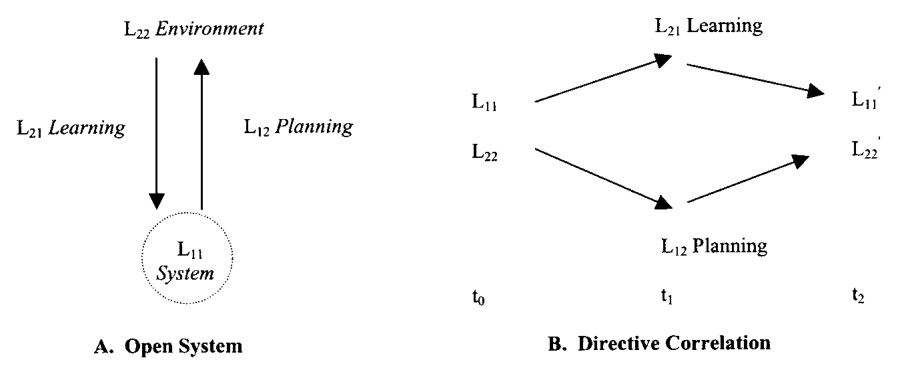
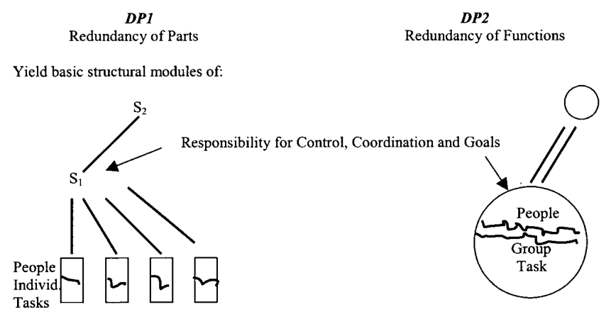
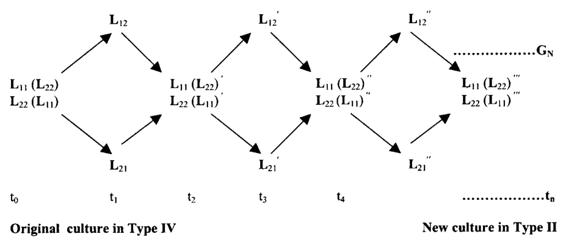
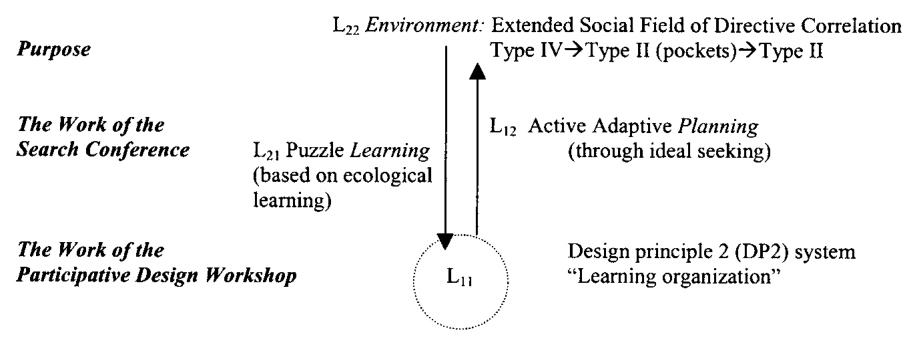

# Emery-M-2000-CurrentVersionOST — Distillation

> Source: Merrelyn Emery, "The Current Version of Emery's Open Systems Theory," *Systemic Practice and Action Research*, Vol. 13, No. 5, 2000, pp. 623–643 (21 pages)
> Date distilled: 2026-03-03
> Distilled by: Claude (via distill skill)
> Register: mixed (empirical social science + practitioner-applied)
> Tone: mixed (personal-reflexive in historical/polemical sections; impersonal-objective in formal treatment)
> Density: accessible-general
> Source type: PDF (journal article)

## Core Argument

OST(E) — Open Systems Theory as developed primarily by Fred Emery — is distinguished from all other systems approaches by its adherence to the "thin red line," an intellectual genealogy running Leibniz → Peirce → Pepper → F. Emery. This genealogy commits OST(E) to material universals (structural corroboration across diverse contexts), transaction (mutual influence where both parties change), and Pepper's contextualism (the only world hypothesis handling novelty and change). The rival stream — abstract universals running Kant → Newton → Freud → Lewin → most of GST — produces closed-system thinking (analysis, interaction, mechanism/organicism/formism) that cannot account for open, purposeful systems-in-environments. The paper argues that General Systems Theory became "part of the problem" because it applied closed-system assumptions to inherently open phenomena.

The formal architecture of OST(E) rests on four parameters (L11/L12/L21/L22) unified by Sommerhoff's directive correlation — the necessary condition for adaptive relationships, requiring that system and environment maintain correspondence in terms of direction across time (t0 → t1 → t2). The system principle (L11) is Angyal's unitas multiplex: members relate through the whole, not through pairwise connections. The environment (L22) is the extended social field of directive correlations with its own causal texture, changing historically through Type II (cooperative) → Type III (competitive/industrial) → Type IV (turbulent/post-1945). The capacity for potential directive correlation — imagining and expecting states that do not yet exist — grounds ideal-seeking, the highest functional level, which requires DP2 structures to be activated at all organizational levels.

The practical method for achieving cultural change is the two-stage model: (1) the Search Conference changes the L11 ↔ L22 relation through environmental scanning, puzzle learning, and rationalization of conflict; (2) the Participative Design Workshop changes intra-L11 by enabling workers to redesign their own coordination structure from DP1 (redundancy of parts) to DP2 (redundancy of functions). The sequence is mandatory — environmental understanding before structural change. The normative goal is transformation from Type IV turbulence to a modern Type II: associative, joyful, and wise. The paper documents the post-Tavistock divergence between the Emery path (design principles, rationalization of conflict, time-based SC) and the Trist/Ackoff path (domain theory, consensus, time-free idealized design, committees), arguing that only the Emery path changes the genotype.

## Key Concepts

| Concept | Definition | Significance |
|---------|-----------|--------------|
| OST(E) | Open Systems Theory developed by Fred Emery; distinguished from other variants by adherence to the thin red line | The framework itself — all other concepts are components |
| Thin red line | Intellectual genealogy: Leibniz → Peirce → Pepper → F. Emery; the realist/material-universals stream | Foundational premise; establishes OST(E)'s philosophical pedigree and boundary against idealist/mechanist alternatives |
| Material vs abstract universals | Two epistemological streams: material = structural corroboration, transaction, synthesis, person-in-environment; abstract = multiplicative corroboration, interaction, analysis, intra-individual | Boundary condition — explains why most systems theory went wrong (applied abstract-universal methods to open-system phenomena) |
| L11/L12/L21/L22 | Four parameters of the open system: L11 = system principle, L12 = planning function (system → environment), L21 = learning function (environment → system), L22 = environment's causal texture | The formal mechanism underlying all OST(E) analysis |
| Directive correlation (DC) | Sommerhoff: necessary condition for adaptive relationship — system and environment at exact correspondence for a goal, correlated in terms of direction across t0 → t1 → t2 | "The central concept of OST(E)" — encompasses purposive behavior, coevolution, perception, cognition, motivation |
| Potential directive correlation | Capacity to imagine and expect — envisioning states that do not yet exist and acting to bring them about | Grounds ideal-seeking; distinguishes purposeful from merely purposive systems |
| Transaction vs interaction | Transaction = mutual influence where both parties change; interaction = exchange without mutual change. Transaction → synthesis, open systems; interaction → analysis, closed systems | THE foundational ontological distinction for OST(E); maps to the two-streams argument |
| Unitas multiplex (system principle) | Angyal: unity of multiplicities — system members relate to each other through their relation to the whole, not through pairwise connections | Defines L11; radically different from network/pairwise models (Ackoff) |
| Contextualism | Pepper's world hypothesis: events in unique contexts; novelty and change are real; structural invariants found through structural corroboration | The only world hypothesis that can handle novelty and change; all others (mechanism, organicism, formism) are closed and static |
| DP1 / DP2 | Genotypical design principles. DP1 = redundancy of parts (responsibility ≥1 level above work); DP2 = redundancy of functions (responsibility with people doing the task) | Operational lever for structural change; DP1 yields supervisory hierarchy, DP2 yields self-managing groups |
| Environmental types (II/III/IV) | Type II = cooperative, stable values (~beginnings–1790); Type III = competitive, industrial (~1790–1945); Type IV = turbulent, dynamic field (1945–present) | Historical framework for cultural change; normative goal = modern Type II |
| Four ideals | Homonomy (belonging/interdependence), Nurturance (cultivating means), Humanity (what is fitting for us), Beauty (aesthetic order) — corresponding to L21, L12, L11, L22 respectively | Structural attractors for ideal-seeking systems; spring from potential directive correlation |
| Two-stage model (SC + PDW) | SC changes L11 ↔ L22 relation; PDW changes intra-L11. Sequence mandatory: environmental understanding before structural redesign | The practical method for active adaptive cultural change |
| Ecological learning | Gibson: direct extraction of meaningful information from environments; people are ecological learners, not tabulae rasae | Epistemological foundation — challenges stimulus-response and teaching-based models |
| Puzzle learning vs problem solving | Problem solving = known endpoint, means-based; puzzle learning = unknown endpoint, figure-ground reversals, perceptual exploration | Distinguishes Type IV adaptation (puzzle) from Type II/III (problem); SC uses puzzle learning |
| Functional level hierarchy | Goal-seeking → purposefulness → ideal-seeking. DP1 limits members to goal-seeking; DP2 gives "one more degree of freedom" enabling ideal-seeking | Explains why DP2 is structurally necessary for the highest adaptive capacity |
| Learning organization | "An organization structured in such a way that its members can learn and continue to learn within it." Organizations cannot learn — only people learn; structure enables or prevents | Only achievable under DP2; DP2 = variety-increasing, DP1 = variety-decreasing |
| AXB model | Newcomb/Asch: A and B are people/groups, X is object of mutual concern. Minimum elements for task-mediated change | Underpins SC design: learning and research proceed most effectively through shared engagement with X |

## Figures, Tables & Maps

### Figure 1: The Models of Open System and Directive Correlation

- **What it shows**: Two-panel diagram. (A) Open System: L11 (System) as dashed circle at center; L22 (Environment) above; bidirectional arrows labeled L21 (Learning, downward) and L12 (Planning, upward). (B) Directive Correlation: temporal trajectory t0 → t1 → t2; L11 and L22 as starting states at t0; L12 (Planning) and L21 (Learning) as crossing arrows through t1; L11' and L22' as changed states at t2.
- **Key data points**: Panel A shows the four L-parameters as a static structural model. Panel B adds the temporal dimension — both system and environment change through the directive correlation cycle, producing L11' and L22' (primed states) at t2. The crossing arrows at t1 show simultaneous planning and learning.
- **Connection to argument**: This is THE foundational diagram of OST(E). Panel A establishes the four parameters; Panel B adds Sommerhoff's directive correlation as the temporal mechanism of adaptation.

### Figure 2: The Genotypical Organizational Design Principles

- **What it shows**: Side-by-side structural comparison. Left (DP1): hierarchical tree — S2 supervises S1, who supervises individual people assigned to individual tasks (one person per task). Right (DP2): single self-managing circle containing "People / Group Task" with responsibility for control, coordination, and goals located within the group itself.
- **Key data points**: DP1 has ≥2 supervisory levels (S2, S1) above workers. Workers are separated and matched 1:1 with tasks. DP2 has zero supervisory levels — the group holds all responsibility. The structural module under DP1 is a branching hierarchy; under DP2 it is a unified circle.
- **Connection to argument**: Visualizes the genotypical distinction. DP1 = redundancy of parts (more people than needed at any time, compensated by supervision). DP2 = redundancy of functions (more skills built into each person than used at any time, coordinated by the group).

### Figure 3: Codetermination of Cultural Change Over Time

- **What it shows**: Iterated directive correlation cycles from t0 through t1, t2, t3, t4 to tn. Each cycle has the diamond structure: L11(L22) and L22(L11) at the base; L12 (Planning) rising to the apex; L21 (Learning) descending. Each cycle produces primed versions (L11', L22' → L11'', L22'' → ...). A dotted line labeled GN connects the final cycle to "New culture in Type II." The starting point is labeled "Original culture in Type IV."
- **Key data points**: The coimplication notation L11(L22) and L22(L11) shows that each parameter is a function of the other. Each successive cycle produces changed states. The endpoint (modern Type II) is reached through an indefinite number of cycles (tn). GN appears to denote the cumulative goal.
- **Connection to argument**: This figure operationalizes the normative vision — cultural change from Type IV to modern Type II through iterated sequences of directive correlation. Each SC + PDW cycle is one iteration. The coimplication notation formalizes the claim that L11 and L22 are mutually determining.

### Figure 4: The Two-Stage Model for Active Socioecological Adaptation

- **What it shows**: Modified open-system diagram (same structure as Fig. 1A) with method annotations. L22 = "Environment: Extended Social Field of Directive Correlation" with progression "Type IV → Type II (pockets) → Type II." L12 = "Active Adaptive Planning (through ideal seeking)." L21 = "Puzzle Learning (based on ecological learning)." L11 = system circle. Left side: two method labels — "The Work of the Search Conference" (adjacent to L21/L12) and "The Work of the Participative Design Workshop" (adjacent to L11). Right side: "Design principle 2 (DP2) system / 'Learning organization.'" "Purpose" labels the L22 region.
- **Key data points**: SC maps to L21 (puzzle learning) and L12 (active adaptive planning). PDW maps to L11 (restructuring to DP2). The environmental trajectory is Type IV → Type II (pockets) → Type II. The system becomes a "learning organization" through DP2.
- **Connection to argument**: This is the master integration diagram — maps the two-stage model onto the L-channel framework and shows the normative trajectory. Each method targets specific L-channels. The progression through "pockets" of Type II acknowledges that cultural change is gradual and local before becoming widespread.

## Figure ↔ Concept Contrast

- Figure 1A → L11/L12/L21/L22: Spatial rendering of the four parameters as static structural relations
- Figure 1B → Directive correlation: Temporal rendering of the DC mechanism; shows how t0 states produce t2 states through crossed L12/L21 actions
- Figure 1B → Coimplication of L11 and L22: The primed states (L11', L22') show both change through DC
- Figure 2 → DP1/DP2: Structural visualization of genotypical distinction; hierarchy vs. self-managing circle
- Figure 2 → Unitas multiplex: DP2 circle = members relating through the whole (group task); DP1 tree = members relating through supervisory chain
- Figure 3 → Environmental types: Shows trajectory from Type IV (original culture) to Type II (new culture)
- Figure 3 → Two-stage model: Each diamond cycle = one SC + PDW iteration
- Figure 3 → Coimplication: L11(L22) notation formalizes mutual determination
- Figure 4 → Two-stage model: Maps SC to L21/L12 channels; PDW to L11
- Figure 4 → Puzzle learning: SC labeled as puzzle learning (based on ecological learning)
- Figure 4 → Functional level hierarchy: L12 labeled "through ideal seeking" — the highest functional level
- Figure 4 → Learning organization: DP2 system labeled as learning organization at L11

## Theoretical & Methodological Implications

**Method**: Theoretical synthesis + intellectual history + practitioner advocacy. The paper synthesizes formal concepts (L-matrix, DC, system principle) with intellectual genealogy (thin red line) and polemical argument (against GST, Ackoff, Trist). It is not empirical in the data-collection sense but draws on ~40 years of accumulated practical learning from SC/PDW interventions as structural corroboration.

**Epistemology**: Explicitly contextualist (Pepper). Knowledge proceeds by structural corroboration — finding the same structural invariant (e.g., DP1/DP2 effects) across different contexts (coal mines, factories, schools, communities). Rejects multiplicative corroboration (replication under identical conditions) as appropriate only for closed systems.

**Three logics**: OST(E) uses deduction, induction, AND retroduction (Peirce) — inference to the best explanation given structural evidence. This three-logic approach distinguishes it from hypothetico-deductive science and from pure induction.

**Action research ontology**: The researcher-researched distinction collapses; the research relation is collaboration between peers. This is a methodological consequence of the transaction ontology — if people transact, then studying them requires transacting with them, not observing them from outside.

**Genotypical vs phenotypical analysis**: OST(E) seeks genotypes (design principles as structural invariants) not phenotypes (surface appearances). This is the methodological expression of the material-universals commitment — serial genetic constructs, not generic nouns.
