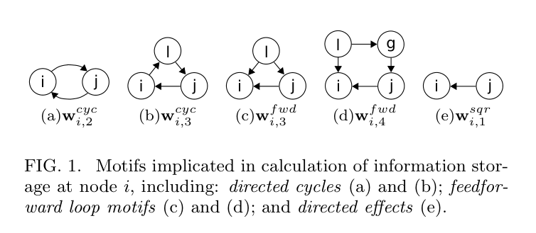
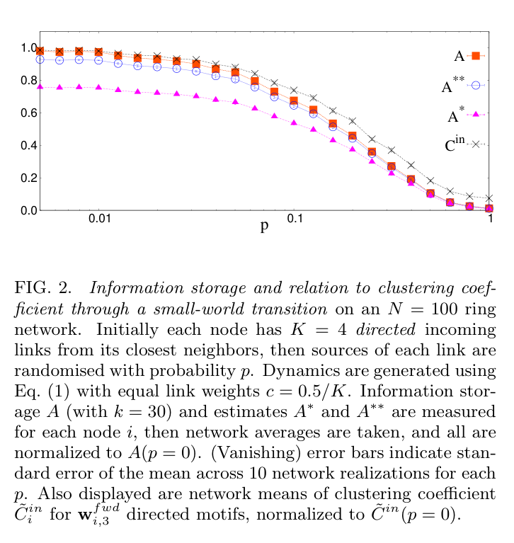

# Lizier-2012-InfoStorage-LoopMotifs — Distillation

> Source: Joseph T. Lizier, Fatihcan M. Atay, and Jürgen Jost, "Information storage, loop motifs and clustered structure in complex networks," *Physical Review E* 86, 026110, 2012. 5pp.
> Date distilled: 2026-03-02
> Distilled by: Claude (via distill skill v5)
> Register: formal-mathematical
> Tone: impersonal-objective
> Density: technical-specialist (assumes information theory, linear algebra, network science)

## Core Argument

Information storage capability at individual network nodes is analytically dominated by two types of local motifs: directed cycles (feedback loops) and feedforward loop motifs. Using a discrete-time linear Gaussian autoregressive model on networks, the authors derive closed-form expansions of active information storage $A(X_i)$ at each node $i$ in terms of weighted motif counts. The key result (Eq. 12): $A^{**}(X_i) = \frac{1}{2}(w^{cyc}_{i,2}(w^{cyc}_{i,2} + 2w^{fwd\prime}_{i,4}) + (w^{fwd}_{i,3})^2 + (w^{cyc}_{i,3})^2)$ — storage is a sum of squared and cross-multiplied loop motif counts. No non-loop structure appears.

Directed cycles enable distributed storage: node $i$ sends information to neighbors and retrieves it via feedback loops at later times — information literally cycles. Feedforward loops enable transient storage: dual paths of different lengths deliver the same information to $i$ at two different time steps — temporal echoes. Both mechanisms predict that clustered network structure promotes information storage — confirmed numerically through Watts-Strogatz small-world transitions where storage monotonically decreases as clustering is randomized ($p: 0 \to 1$).

The results offer a computational explanation for the prevalence of reciprocal links and three-node motifs in biological networks (mammalian cortex, gene regulatory networks) and the superior memory performance of recurrent vs. feedforward artificial neural networks. Critically, eigenvalue analysis cannot capture these effects: isospectral networks can have differing $\langle A(X_i) \rangle$, and feedforward motifs have only zero eigenvalues yet contribute measurably to storage.

## Key Concepts

| Concept | Definition | Significance |
|---------|-----------|--------------|
| Active information storage $A(X_i)$ | Mutual information between joint past states $x^{(k)}_n$ and next state $x_{n+1}$ at node $i$, as $k \to \infty$ | Primary measure; node-local (unlike eigenvalue methods), model-free, directly maps to local motifs |
| Autoregressive network model | $X(n+1) = X(n) \times C + R(n)$; $C$ = weighted adjacency, $R$ = Gaussian noise | Analytical framework; stationary iff spectral radius $\rho(C) < 1$ |
| Covariance series $\Omega$ | $\Omega = \sum_{u=0}^{\infty} (C^u)^T C^u$; lagged: $\Omega(s) = \Omega C^s$ | Bridge between network structure ($C$) and information-theoretic quantities |
| Directed cycles $w^{cyc}_{i,2}$, $w^{cyc}_{i,3}$ | Weighted sum of 2-node reciprocal links ($\sum C_{ij}C_{ji}$) and 3-node directed cycles at node $i$ | Dominant storage mechanism: information cycles through feedback loops; $w^{cyc}_{i,2}$ alone captures the largest component ($A^*$) |
| Feedforward loop motifs $w^{fwd}_{i,3}$, $w^{fwd}_{i,4}$ | Weighted sum of 3/4-node feedforward structures: dual paths of different lengths converging at $i$ | Secondary storage mechanism: same information arrives at $i$ at two different times via different-length paths |
| Directed effects $w^{sqr}_{i,1}$ | $\sum_{j \neq i} C^2_{ji}$ — sum of squared incoming weights at node $i$ | Enters $\Omega(0)_{ii}$; cancels in final $A^{**}$ via Eq. 13 decomposition |
| Estimate $A^*(X_i)$ | $\frac{1}{2}(w^{cyc}_{i,2})^2$ — accurate to $O(\epsilon^4)$, two-node motifs only | Captures largest storage component; reciprocal links dominate |
| Estimate $A^{**}(X_i)$ | Full three-node expansion (Eq. 12) — accurate to $O(\epsilon^6)$ | Adds feedforward and 3-cycle contributions; close numerical approximation to true $A$ |
| Clustering coefficient $\tilde{C}^{in}_i$ | Weighted directed clustering coefficient for $w^{fwd}_{i,3}$ motifs (Fagiolo 2007) | Direct proportionality: $w^{fwd}_{i,3} = \tilde{C}^{in}_i K(K-1)c^2$ for equal weights; nodes with higher clustering store more |
| Watts-Strogatz transition | Ring network ($N=100$, $K=4$ directed), sources randomized with probability $p$ | Validation: $p=0$ (regular lattice) = max clustering + max $A$; $p=1$ (random) = min both |
| Eigenvalue limitation | Dominant $\lambda$ of $C$ bounds correlation decay but cannot differentiate storage across networks with same $\lambda$ | $A(X_i)$ strictly more informative: feedforward motif $w^{fwd}_{i,3}$ has only zero eigenvalues yet stores information |
| Excess entropy $E$ | Total mutual information between past and future; $A(X)$ is sub-component | $A$ captures stored information in use in the next state — directly comparable to information transfer |

## Figures, Tables & Maps

### Figure 1: Loop Motifs Implicated in Information Storage

- **What it shows**: Five motif structures at node $i$: (a) $w^{cyc}_{i,2}$ = 2-node directed cycle (reciprocal link); (b) $w^{cyc}_{i,3}$ = 3-node directed cycle; (c) $w^{fwd}_{i,3}$ = 3-node feedforward loop; (d) $w^{fwd}_{i,4}$ = 4-node feedforward loop; (e) $w^{sqr}_{i,1}$ = directed effects
- **Key data points**: Each motif labeled with weighted sum notation; arrows show directed edges; node $i$ is the measurement point in all cases. Motifs (a)-(d) are the loop structures; (e) is the non-loop baseline
- **Connection to argument**: These are the exact structural elements in the analytic expansion of $A(X_i)$. Directed cycles (a,b) enable information cycling; feedforward loops (c,d) enable delayed re-arrival of same information at different times

### Figure 2: Information Storage Through Small-World Transition

- **What it shows**: Four normalized curves vs. rewiring probability $p$ (log scale): $A$ (true storage, $k=30$), $A^{**}$ (3-node estimate), $A^*$ (2-node estimate), $\tilde{C}^{in}$ (clustering coefficient). $N=100$, $K=4$, equal weights $c=0.5/K$, 10 network realizations per $p$
- **Key data points**: All start ≈1.0 at $p \approx 0.01$, decrease monotonically to ≈0 at $p=1$. $A^{**}$ tracks $A$ closely; $A^*$ captures dominant trend but underestimates; $\tilde{C}^{in}$ mirrors $A$ decay almost exactly
- **Connection to argument**: Validates predictions: (1) estimates approximate well, (2) three-node motifs contribute measurably ($A^{**} > A^*$), (3) clustering ≈ storage, (4) randomization destroys both simultaneously

## Figure ↔ Concept Contrast

- Figure 1 → Directed cycles ($w^{cyc}_{i,2}$, $w^{cyc}_{i,3}$): Diagrams (a) and (b) show structural paths enabling information cycling through feedback loops
- Figure 1 → Feedforward loops ($w^{fwd}_{i,3}$, $w^{fwd}_{i,4}$): Diagrams (c) and (d) show dual-path structures for temporal echo storage
- Figure 1 → Directed effects ($w^{sqr}_{i,1}$): Diagram (e) — baseline incoming signal strength, cancels out of final estimate
- Figure 2 → Clustering coefficient: $\tilde{C}^{in}$ curve overlaps $A$, confirming $w^{fwd}_{i,3} = \tilde{C}^{in}_i K(K-1)c^2$
- Figure 2 → Estimates $A^*$, $A^{**}$: Gap between curves shows three-node motifs add storage beyond reciprocal links alone
- Figure 2 → Eigenvalue limitation: dominant $\lambda$ is identical for all $p$ values (fixed weighted in-degree $cK$), yet $A$ varies dramatically — eigenvalues are blind to the structural differences driving storage

## Equations & Formal Models

### Autoregressive Process
$$X(n+1) = X(n) \times C + R(n) \tag{1}$$
$C = [C_{ji}]$: $N \times N$ weighted adjacency matrix. $R(n)$: uncorrelated mean-zero unit-variance Gaussian noise. Stationary iff $\rho(C) < 1$.

### Covariance Series
$$\Omega = \sum_{u=0}^{\infty} (C^u)^T C^u \tag{2}$$
$$\Omega(s) = \Omega C^s \tag{3}$$
Eq. 3 is this paper's contribution: lagged autocovariance determines information storage capability.

### Active Information Storage
$$A(X) = H(X) - H_\mu(X) \tag{4}$$
$$H_\mu(X) = \lim_{k \to \infty} H(X^{(k+1)}) - H(X^{(k)}) \tag{5}$$
$$A(X_i) = \lim_{k \to \infty} \frac{1}{2} \ln\left(\frac{|\Omega(0)_{ii}| \cdot |M_i(k)|}{|M_i(k+1)|}\right) \tag{6}$$
$M_i(k)$: $k \times k$ symmetric Toeplitz autocovariance matrix built from $\Omega(s)_{ii}$ terms.

### Motif Expansion of Autocovariance
$$\Omega(0)_{ii} = 1 + w^{sqr}_{i,1} + O(\epsilon^4) \tag{7}$$
$$\Omega(1)_{ii} = w^{fwd}_{i,3} + O(\epsilon^5) \tag{8}$$
$$\Omega(2)_{ii} = w^{cyc}_{i,2} + w^{fwd}_{i,4} + O(\epsilon^6) \tag{9}$$
$$\Omega(3)_{ii} = w^{cyc}_{i,3} + O(\epsilon^5) \tag{10}$$
$\Omega(s \geq 4)_{ii}$: $O(\epsilon^4)$ or smaller — enters $A$ below $O(\epsilon^6)$. Only loop motifs of length $s$ contribute to $\Omega(s \geq 1)_{ii}$.

### Storage Estimates
$$A^*(X_i) = \frac{1}{2}(w^{cyc}_{i,2})^2 \tag{11}$$
$$A^{**}(X_i) = \frac{1}{2}\left(w^{cyc}_{i,2}(w^{cyc}_{i,2} + 2w^{fwd\prime}_{i,4}) + (w^{fwd}_{i,3})^2 + (w^{cyc}_{i,3})^2\right) \tag{12}$$
$$w^{fwd}_{i,4} = w^{sqr}_{i,1} \cdot w^{cyc}_{i,2} + w^{fwd\prime}_{i,4} \tag{13}$$
$w^{fwd\prime}_{i,4}$ adds restriction $g \neq i$, factoring out the reducible component.

## Theoretical & Methodological Implications

**Method**: Analytic expansion of information-theoretic measures on linear Gaussian network dynamics, following Barnett et al. (2009, 2011). Combines closed-form derivation (motif expansion to $O(\epsilon^6)$) with numerical validation (Watts-Strogatz, $N=100$, 10 realizations/point).

**Strengths**: Node-local measure vs. network-global eigenvalue methods. Model-free formulation applicable beyond linear Gaussian case. Direct structural interpretation: each expansion term maps to a specific network motif. Sub-component of excess entropy $E$ — directly comparable to information transfer.

**Limitations**: Analytic results strictly valid for linear interactions only, though argued as approximations in the weakly coupled near-linear regime. Self-connections $C_{ii} \to 0$ for tractability. Expansion to $O(\epsilon^6)$ only — higher-order motifs at $O(\epsilon^8)+$. Numerical validation limited to equal-weight networks. 5-page Letter format — extended treatment deferred to [21].

**Key methodological claim**: $A(X_i)$ captures storage invisible to eigenvalue analysis. Feedforward motif $w^{fwd}_{i,3}$ has only zero eigenvalues yet contributes measurably. Isospectral networks can have differing $\langle A(X_i) \rangle$. Separates computational perspective (per-node storage) from spectral perspective (network-wide persistent memory).

**Connection to TSE complexity**: Same motifs drive both $A(X_i)$ and Tononi-Sporns-Edelman complexity with different contributions, suggesting TSE complexity contains a significant information storage component. Aligns with information-geometric framework (Ay et al. 2011).

**Biological implications**: Explains prevalence of reciprocal links ($w^{cyc}_{i,2}$) and connected three-node motifs in mammalian cortex (Song et al. 2005, Sporns 2011); of $w^{fwd}_{i,3}$ in gene regulatory networks (Milo et al. 2002); and superior memory in recurrent vs. feedforward ANNs (echo state networks, Elman networks).
