# Lizier-Synchronizability-Slideshow — Distillation

> Source: Joseph T. Lizier, "Analytic relationship of relative synchronizability to network structure and motifs," presentation slides (26 slides), Centre for Complex Systems, School of Computer Science, The University of Sydney. Accompanies Lizier et al., *PNAS* 120(37), e2303332120 (2023).
> Date distilled: 2026-03-02
> Distilled by: Claude (via distill skill)
> Register: formal-mathematical
> Tone: impersonal-objective
> Density: technical-specialist (assumes network science, linear algebra, stochastic processes)

**Relationship to main paper distillation**: SUPPLEMENTARY. The main paper distillation is [Lizier-Synchronizability-Motifs.md](Lizier-Synchronizability-Motifs.md). This slideshow provides: (1) pedagogical scaffolding building the limitations stack, (2) explicit three-part research program structure, (3) the critical interpretive reframe linking closed dual walk motifs to information storage (slide 22), (4) future direction on coupling delays.

## Core Argument

The presentation builds a three-part research program: (1) determine whether a network is synchronizable, (2) rank relative synchronization quality via $\langle\sigma^2\rangle$, (3) understand how this relates to network structure including motifs. A fourth part (coupling delays) is flagged as future work. The derivation shows $\langle\sigma^2\rangle$ decomposes into a difference between closed dual walk motif counts (convergent paths reinforcing perturbations locally) and all dual walk motif counts (dissipating perturbations globally). The central interpretive claim — absent from the paper's foregrounding — is that closed dual walk motifs ARE information storage structures: they store traces of dynamics locally, hindering dissemination. This connects synchronizability directly to information theory (Lizier, Atay & Jost 2012) and explains why loop-rich clustered networks are prevalent in biology: they serve the functional purpose of local information storage at the cost of global coordination.

## Key Concepts

| Concept | Definition | Significance |
|---------|-----------|--------------|
| $\langle\sigma^2\rangle$ (relative synchronizability) | Expected steady-state deviation from synchronization under driving noise; $\langle\sigma^2\rangle = \frac{1}{N}\sum_i\langle(x_i(t) - \bar{x}(t))^2\rangle$ | Primary measure; smaller = better sync. Equivalent to total integrated deterministic perturbation response |
| $C = [C_{YX}]$ (connectivity matrix) | $N \times N$ weighted adjacency; $C_{YX}$ = weight of directed connection $Y \to X$. Normalised Laplacian $L = I - C$ | Structure encoding; no symmetry, nonnegativity, or diagonalizability required |
| $\psi_0 = [1,1,...,1]$ (synchronized state) | Zero mode / eigenvector of $C$ with $\lambda_0 = 1$; all nodes at same value | Assumed throughout; implies diffusive coupling (incoming weights sum to 1 per node) |
| Discrete-time dynamics (VAR) | $\vec{x}(t+1) = \vec{x}(t)C + \vec{r}(t)$; sync condition: $\|\lambda\| < 1$ for all $\lambda \neq \lambda_0$ | Linear regime; uncorrelated noise in time → only same-length walk pairs contribute |
| Continuous-time dynamics (Ornstein-Uhlenbeck) | $d\vec{x}(t) = -\vec{x}(t)(I-C)dt + d\vec{w}(t)$; sync condition: $\text{Re}(\lambda) < 1$ for all $\lambda \neq \lambda_0$ | Linear regime; integrated noise → different-length walk pairs contribute (richer motif structure) |
| $\Omega$ (network covariance matrix) | $\Omega = \lim_{t\to\infty}\langle\vec{x}(t)^T\vec{x}(t)\rangle$; projects to $\Omega_U = U^T\Omega U$ in space orthogonal to $\psi_0$ | Bridge: $\langle\sigma^2\rangle = \frac{1}{N}\text{trace}(\Omega_U)$; if we write down $\Omega_U$ we write down $\langle\sigma^2\rangle$ |
| Weighted dual walk count $\mathbf{w}^{a\to e,M_2}_{a\to b,M_1}$ | Product of two walk counts from same source: $\mathbf{w}_{a\to b,M_1}\cdot\mathbf{w}_{a\to e,M_2} = (C^{M_1})_{ab}(C^{M_2})_{ae}$ | Structural decomposition unit; closed ($e=b$) vs open ($e\neq b$) determines sync vs desync contribution |
| Closed dual walk motifs | Both walks from source $k$ end at same target $i$: $\mathbf{w}^{k\to i,m-u}_{k\to i,u}$ | POSITIVE contribution to $\langle\sigma^2\rangle$ (hinders sync); reinforces perturbations locally |
| Open dual walk motifs | Walks from $k$ end at different targets $i,j$: $\mathbf{w}^{k\to j,m-u}_{k\to i,u}$ | NEGATIVE contribution (averaged over $j$, divided by $N$); dissipates perturbations globally |
| Information storage motifs | Closed walk motifs = information storage structures (Lizier, Atay & Jost 2012); store traces of dynamics locally | Critical reframe: not merely "bad for sync" but functionally important — local storage at cost of global coordination |
| Prior heuristics | $\lambda_{\min}/\lambda_{\max}$ of $L$, $\lambda_{\max}$ of $C$ — labeled "limited: heuristic, empirical or symmetric" | Demolished: $\langle\sigma^2\rangle$ can change by order of magnitude while $\text{Re}(\lambda_1)$ shows virtually no change |
| Low-order approximations $\langle\sigma^2_M\rangle$ | Truncate walk length at $M$; shorter walks contribute more strongly | M=2 sufficient for random networks; clustered networks need higher-order terms |
| Modularity effect | Modularity enhances sync inside module, decreases across network | Stated more directly than in paper; key for family group architecture |
| Coupling delays | Future work: "Relating synchronizability with delays to network structure and motifs" (Lizier, Atay, Jost, in preparation) | Natural extension to multi-timescale dynamics; relevant to differential time dilation |

## Figures, Tables & Maps

### Slide 5: Network Structure and Three-Part Aim

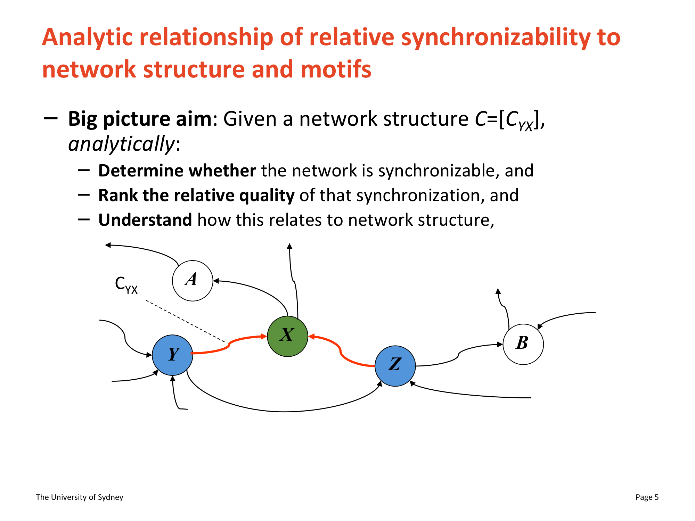

- **What it shows**: Directed weighted network with 5 nodes (Y, X, Z blue; A, B gray). Node A has self-loop. Dashed line labeled $C_{YX}$ shows coupling weight $X \to Y$. Two walk paths highlighted in red/orange
- **Key data points**: Self-loop on A = visual prototype of L11. Asymmetric directed edges = L12/L21. Three-part aim listed: determine synchronizability, rank quality, relate to structure
- **Connection to argument**: Grounds the entire formalism visually; $C = [C_{YX}]$ encodes this structure, and the question is what $\langle\sigma^2\rangle$ it produces

### Slide 6: Dynamics Comparison Table

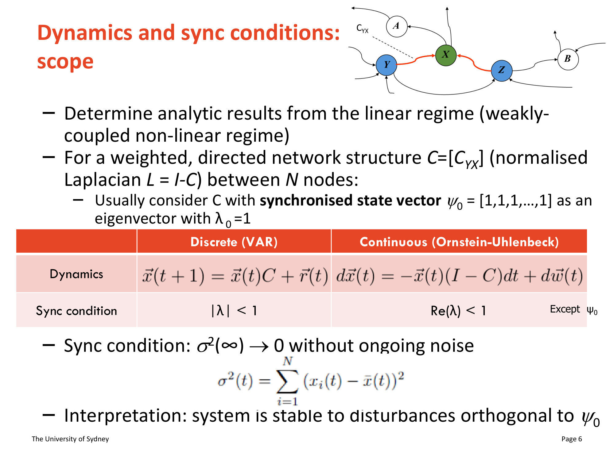

- **What it shows**: 4-node colored network (green, red, blue, yellow) + comparison table of discrete (VAR) vs continuous (Ornstein-Uhlenbeck) dynamics. Equations for both regimes. Sync condition: $|\lambda| < 1$ (discrete) vs $\text{Re}(\lambda) < 1$ (continuous). Definition of $\sigma^2(t) = \sum_{i=1}^{N}(x_i(t) - \bar{x}(t))^2$
- **Key data points**: Both converge to $\sigma^2(\infty) \to 0$ without ongoing noise. $\psi_0 = [1,1,...,1]$ with $\lambda_0 = 1$
- **Connection to argument**: Establishes the two dynamical regimes that produce different motif contributions (same-length vs different-length walks)

### Slide 13: Covariance Projection (Pivotal Mathematical Step)

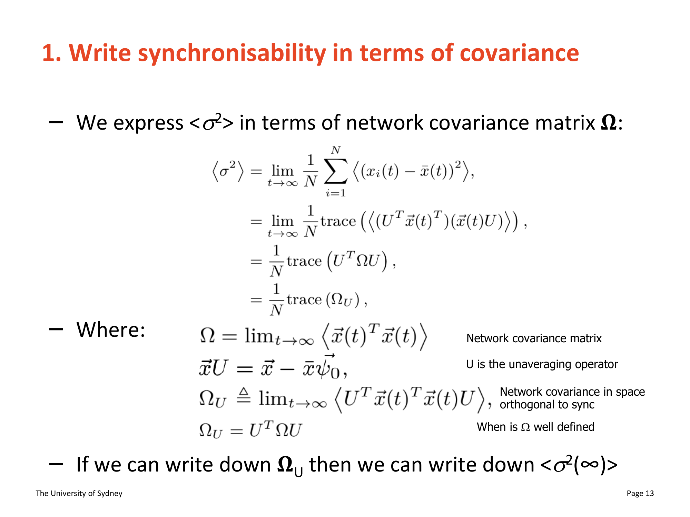

- **What it shows**: Full derivation chain: $\langle\sigma^2\rangle = \frac{1}{N}\text{trace}(\Omega_U)$ where $\Omega_U = U^T\Omega U$, $\vec{x}U = \vec{x} - \bar{x}\psi_0$, $U$ = unaveraging operator
- **Key data points**: "If we can write down $\Omega_U$ then we can write down $\langle\sigma^2(\infty)\rangle$" — reduces problem to covariance computation in orthogonal complement of synchronized state
- **Connection to argument**: The pivotal mathematical move enabling the entire motif decomposition

### Slide 14: Barnett Power Series and Its Limitation

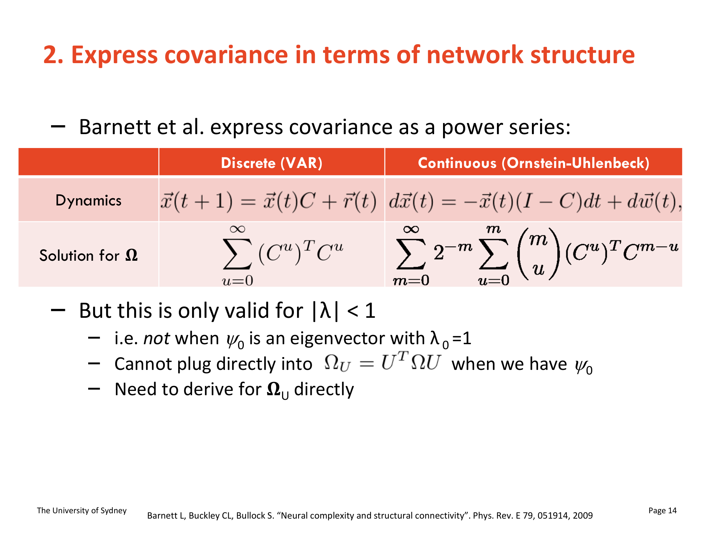

- **What it shows**: Barnett et al.'s covariance as power series for discrete ($\Omega = \sum_{u=0}^{\infty}(C^u)^TC^u$) and continuous ($\Omega = \sum 2^{-m}\binom{m}{u}(C^u)^TC^{m-u}$). But: only valid for $|\lambda| < 1$ — fails when $\psi_0$ is eigenvector with $\lambda_0 = 1$
- **Key data points**: Cannot plug directly into $\Omega_U = U^T\Omega U$ when $\Omega$ itself doesn't converge
- **Connection to argument**: Motivates the paper's core technical contribution: deriving $\Omega_U$ directly

### Slide 15: Extended Solution for $\Omega_U$

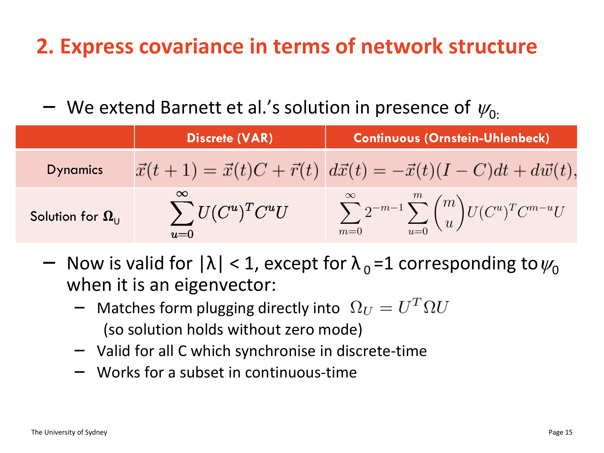

- **What it shows**: The paper's extension — inserts $U$ operators into the power series: discrete $\Omega_U = \sum U(C^u)^TC^uU$, continuous with $\binom{m}{u}$ terms. Valid for $|\lambda| < 1$ except $\lambda_0 = 1$
- **Key data points**: Matches form of direct plug-in (solution holds without zero mode). Valid for all synchronizing $C$ in discrete time; subset in continuous time
- **Connection to argument**: The technical advance enabling the general analytic solution

### Slide 16: Full Analytic $\langle\sigma^2\rangle$

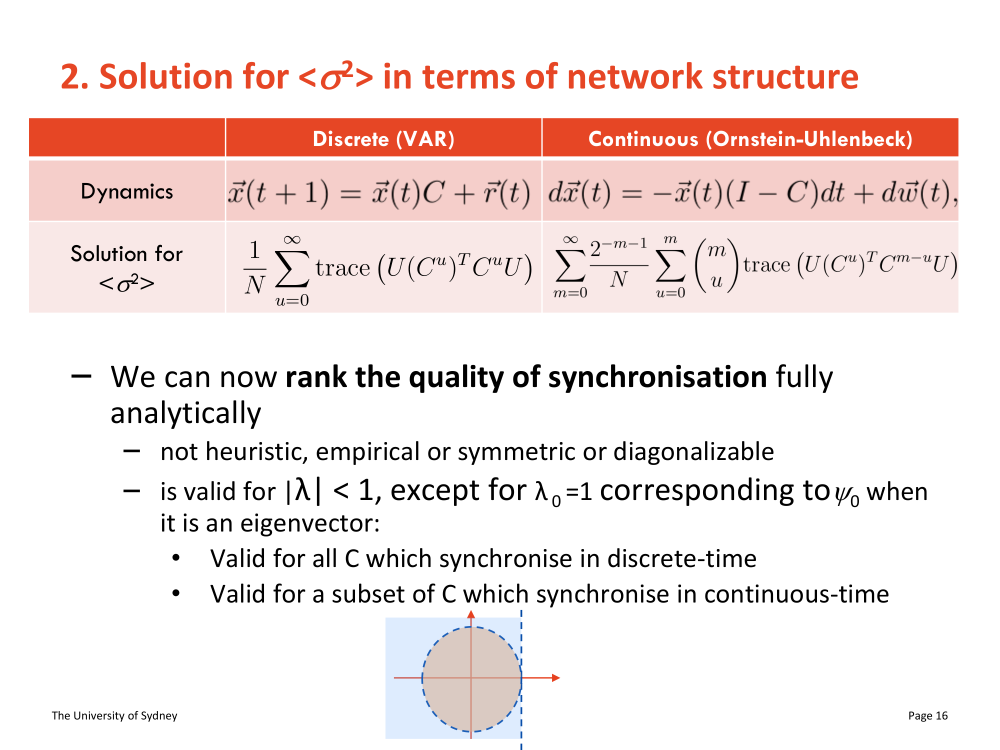

- **What it shows**: Complete solutions — discrete: $\langle\sigma^2\rangle = \frac{1}{N}\sum_{u=0}^{\infty}\text{trace}(U(C^u)^TC^uU)$; continuous with binomial sum. "We can now rank the quality of synchronisation fully analytically — not heuristic, empirical or symmetric or diagonalizable"
- **Key data points**: Circle diagram showing eigenvalue unit disk with $\lambda_0$ excluded
- **Connection to argument**: The achievement: fully general analytic synchronizability ranking

### Slide 17: Numerical Validation

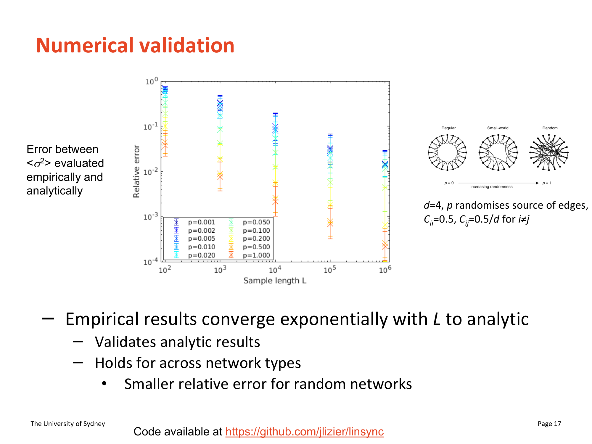

- **What it shows**: Log-log plot of relative error between empirical and analytic $\langle\sigma^2\rangle$ vs sample length $L$. N=100 Watts-Strogatz, $d=4$, $C_{ii}=0.5$, $C_{ij}=0.5/d$. Ten values of $p$ from 0.002 to 1.000. Right: network topology diagrams (regular → small-world → random)
- **Key data points**: Exponential convergence across all $p$. Random networks (high $p$) converge fastest. At $L = 10^6$, relative error $< 10^{-3}$ for all $p$
- **Connection to argument**: Quantitative validation of the analytic formula

### Slide 19: Three-Stage Derivation for Continuous-Time

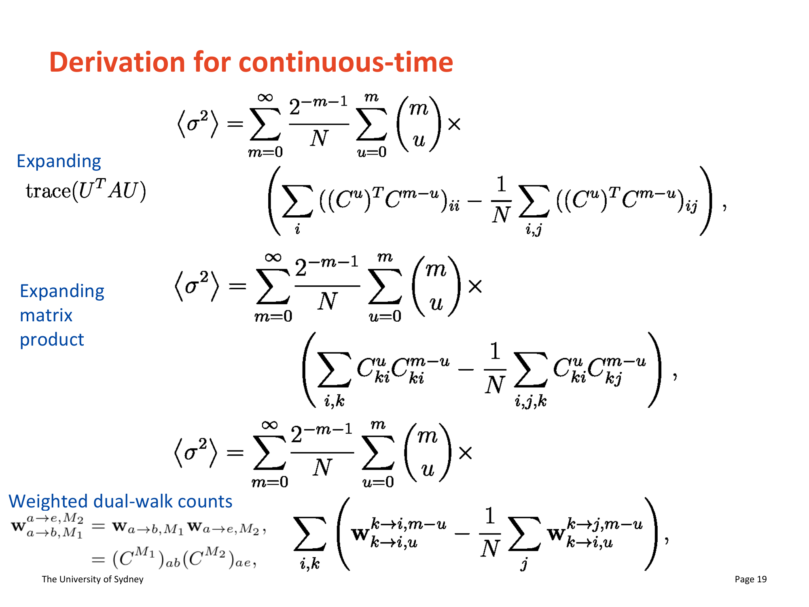

- **What it shows**: Three transformation stages: (1) expanding trace$(U^TAU)$ into diagonal − off-diagonal, (2) expanding matrix products to element-level $C^u_{ki}C^{m-u}_{ki}$ terms, (3) rewriting as weighted dual walk counts $\mathbf{w}^{k\to i,m-u}_{k\to i,u}$
- **Key data points**: Notation: $\mathbf{w}^{a\to e,M_2}_{a\to b,M_1} = \mathbf{w}_{a\to b,M_1}\mathbf{w}_{a\to e,M_2} = (C^{M_1})_{ab}(C^{M_2})_{ae}$
- **Connection to argument**: The derivation heart — matrix algebra naturally decomposes into products of walk counts = process motifs

### Slides 20–21: Process Motif Diagrams (CRITICAL VISUAL)

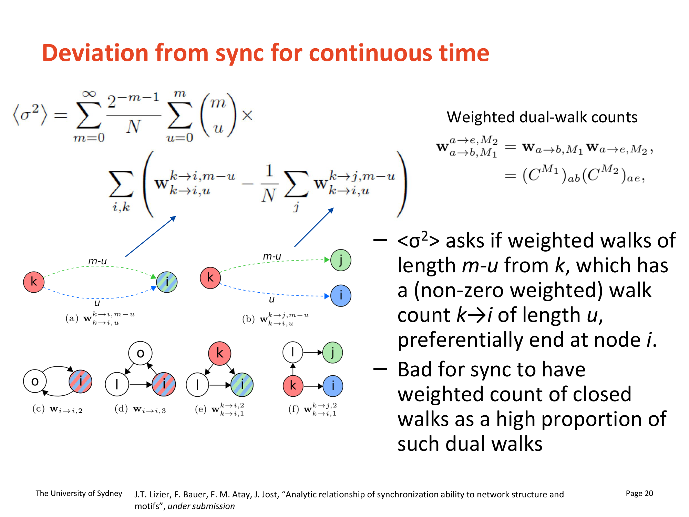

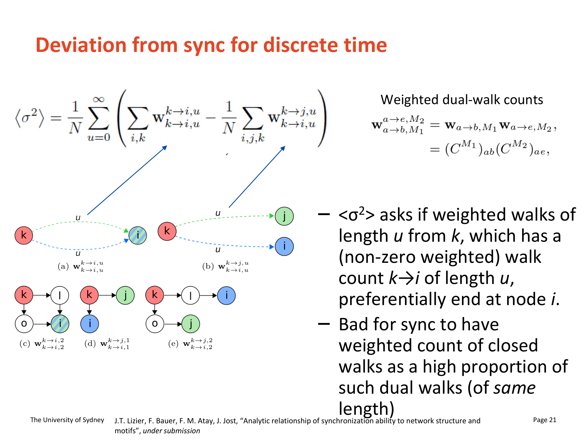

- **What it shows**: Side-by-side continuous (slide 20) and discrete (slide 21) process motif diagrams. Each shows: (top) equation + motif node diagrams — green node $k$ (source), blue node $i$ (target), red node $j$ (alternate target). Two walks depicted as colored arrow arcs. (bottom) Five specific motif examples labeled (a)–(e): (a) $\mathbf{w}_{i\to i,1}$ self-loop, (b) $\mathbf{w}^{k\to i,1}_{k\to i,1}$ shortest closed dual walk, (c) $\mathbf{w}_{i\to i,2}$ feedback loop length 2, (d) $\mathbf{w}^{k\to i,1}_{k\to i,3}$ asymmetric closed dual walk, (e) $\mathbf{w}^{k\to j,1}_{k\to i,2}$ open dual walk
- **Key data points**: Continuous: walks of lengths $m-u$ and $u$ (can differ). Discrete: both walks of length $u$ (must match). "Bad for sync to have weighted count of closed walks as a high proportion of such dual walks"
- **Connection to argument**: Makes the abstract equations concrete — the PROPORTION of closed vs open dual walks determines $\langle\sigma^2\rangle$

### Slide 22: Information Storage Motifs (KEY INTERPRETIVE SLIDE)

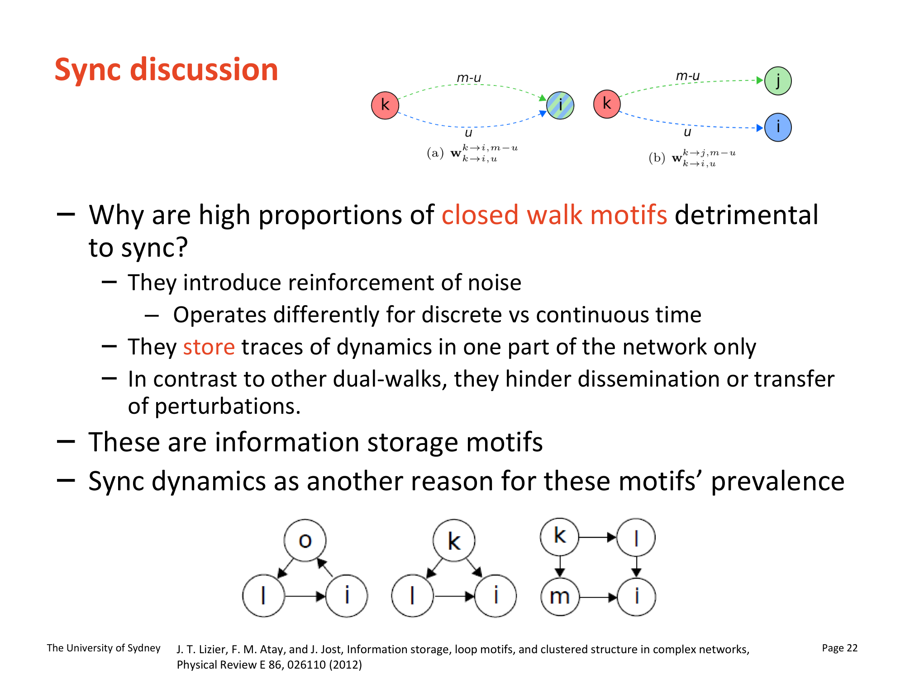

- **What it shows**: (Top) Closed walk motif illustrations from slides 20-21, now labeled as information storage structures. (Bottom) Directed clustered network from Lizier, Atay & Jost 2012 showing internal loops within clusters and weak between-cluster connections
- **Key data points**: Five bullet points: (1) noise reinforcement, (2) discrete/continuous differences, (3) "They store traces of dynamics in one part of the network only," (4) "hinder dissemination or transfer of perturbations," (5) **"These are information storage motifs."** Cites Lizier et al. 2012 (PhysRevE)
- **Connection to argument**: The critical reframe not foregrounded in the paper: closed dual walks are not merely sync-hindering — they are functionally important information storage structures explaining their prevalence in biological networks

### Slide 23: Sync Insights — Watts-Strogatz Validation

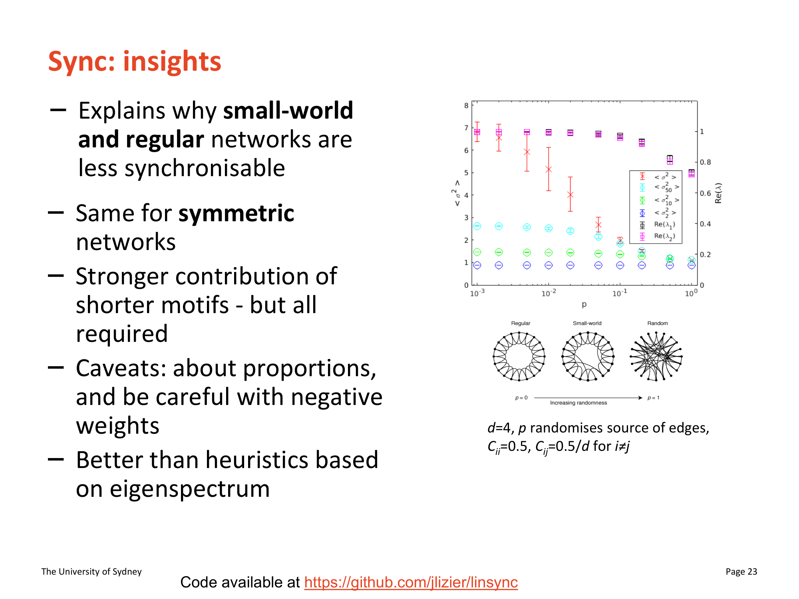

- **What it shows**: (Left) Bullet-point summary of findings. (Right) Chart showing $\langle\sigma^2\rangle$ vs $p$ for different approximation orders, plus network topology diagrams at regular/small-world/random. $d=4$, $C_{ii}=0.5$, $C_{ij}=0.5/d$
- **Key data points**: "Stronger contribution of shorter motifs — but all required" (emphasized). Regular/small-world less synchronizable than random. Better than eigenspectrum heuristics. Caveats: about proportions; careful with negative weights
- **Connection to argument**: Consolidates empirical validation; "all required" = cannot shortcut with low-order approximation for clustered networks

### Slide 24: Sync Insights — Eigenvalue Failure + Modularity

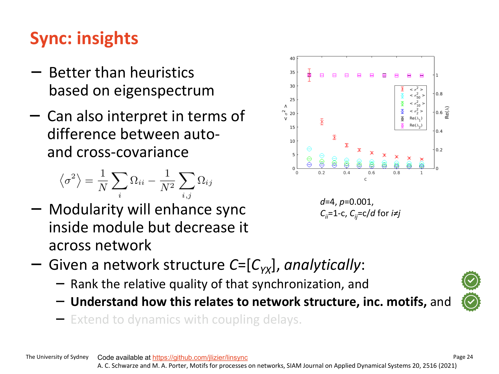

- **What it shows**: (Left) Additional insights. (Right) Chart showing $\langle\sigma^2\rangle$ vs coupling strength $c$ at fixed $p=0.001$, with eigenvalue heuristic overlay. $d=4$, $C_{ii}=1-c$, $C_{ij}=c/d$
- **Key data points**: $\langle\sigma^2\rangle$ changes by order of magnitude while eigenvalue heuristics show virtually no change = most devastating demonstration of heuristic failure. "Modularity will enhance sync inside module but decrease it across network" — stated more directly than in paper. Auto- vs cross-covariance interpretation: $\langle\sigma^2\rangle = \frac{1}{N}\sum_i\Omega_{ii} - \frac{1}{N^2}\sum_{i,j}\Omega_{ij}$
- **Connection to argument**: Eigenvalue heuristics demolished; modularity effect stated directly

## Figure ↔ Concept Contrast

- Slide 5 → $C = [C_{YX}]$: Visual grounding of the connectivity matrix as a directed weighted network
- Slide 6 → Discrete/continuous dynamics: Side-by-side equations establishing the two regimes
- Slide 13 → $\Omega$ / $\Omega_U$: Derivation chain reducing $\langle\sigma^2\rangle$ to covariance computation
- Slides 14–16 → Power series extension: Technical advance from Barnett's $\Omega$ to the paper's $\Omega_U$
- Slide 17 → Numerical validation: Exponential convergence of analytic formula across all $p$
- Slide 19 → Dual walk counts: Three-stage derivation exposing process motif structure
- Slides 20–21 → Closed vs open dual walks: The structural decomposition that IS the main result; continuous vs discrete walk-length constraints
- Slide 22 → Information storage motifs: The interpretive bridge to Lizier 2012 — closed walks = storage structures
- Slide 23 → Low-order approximations: "All required" for clustered networks
- Slide 24 → Eigenvalue limitation + modularity: Heuristics blind to order-of-magnitude $\langle\sigma^2\rangle$ changes; modularity = local sync + global desync

## Equations & Formal Models

### Kuramoto Model (Slide 4)
$$\dot{\theta}_X(t) = \omega_X + K \sum_{Y=1}^{P} A_{XY} \sin(\theta_Y(t) - \theta_X(t))$$
- $\theta_X(t)$: phase of oscillator $X$ at time $t$ (scalar, radians)
- $\omega_X$: natural frequency of oscillator $X$ (scalar, rad/s)
- $K$: coupling strength (scalar, dimensionless)
- $A_{XY}$: adjacency matrix element; weight of directed connection $X \to Y$ (binary or weighted)
- $P$: total number of oscillators in the population

### Order Parameter (Slide 4)
$$o \cdot e^{i\psi} = \frac{1}{P} \sum_{X=1}^{P} e^{i\theta_X}$$
- $o$: order parameter magnitude (scalar, $[0,1]$); $o=1$ = perfect sync, $o \approx 0$ = desynchronized
- $\psi$: average phase (scalar, radians); centroid of phase distribution on unit circle
- $e^{i\theta_X}$: complex unit phasor for oscillator $X$

### Discrete-Time Dynamics — VAR (Slide 6)
$$\vec{x}(t+1) = \vec{x}(t)C + \vec{r}(t)$$
- $\vec{x}(t)$: row vector of $N$ node values at time step $t$ (1×N)
- $C = [C_{YX}]$: $N \times N$ weighted connectivity matrix; $C_{YX}$ = weight of directed edge $Y \to X$
- $\vec{r}(t)$: mean-zero, unit-variance Gaussian noise (independent across time steps)
- Sync condition: $|\lambda| < 1$ for all eigenvalues $\lambda \neq \lambda_0$

### Continuous-Time Dynamics — Ornstein-Uhlenbeck (Slide 6)
$$d\vec{x}(t) = -\vec{x}(t)(I - C)dt + d\vec{w}(t)$$
- $I$: $N \times N$ identity matrix
- $I - C$: Laplacian-like restoring force matrix
- $d\vec{w}(t)$: multivariate Wiener process increment (Gaussian white noise)
- Sync condition: $\text{Re}(\lambda) < 1$ for all $\lambda \neq \lambda_0$

### Steady-State Deviation (Slide 6)
$$\sigma^2(t) = \sum_{i=1}^{N} (x_i(t) - \bar{x}(t))^2$$
- $\sigma^2(t)$: instantaneous deviation from synchronization at time $t$ (scalar, non-negative)
- $x_i(t)$: state of node $i$ at time $t$
- $\bar{x}(t)$: mean state across all $N$ nodes at time $t$

### Covariance Projection (Slide 13)
$$\langle\sigma^2\rangle = \lim_{t\to\infty} \frac{1}{N} \sum_{i=1}^{N} \langle(x_i(t) - \bar{x}(t))^2\rangle = \frac{1}{N}\text{trace}(\Omega_U)$$
- $\langle\sigma^2\rangle$: expected steady-state deviation from synchronization (scalar)
- $\Omega = \lim_{t\to\infty}\langle\vec{x}(t)^T\vec{x}(t)\rangle$: $N \times N$ network covariance matrix
- $\vec{x}U = \vec{x} - \bar{x}\psi_0$: state vector minus synchronized component (unaveraging)
- $U$: unaveraging operator; projects into space orthogonal to $\psi_0$
- $\Omega_U = U^T\Omega U$: covariance projected into orthogonal-to-sync space

### Power Series for $\Omega$ (Slide 14 — Barnett et al.)

Discrete: $\Omega = \sum_{u=0}^{\infty} (C^u)^T C^u$

Continuous: $\Omega = \sum_{m=0}^{\infty} 2^{-m} \sum_{u=0}^{m} \binom{m}{u} (C^u)^T C^{m-u}$

- Only valid for $|\lambda| < 1$; fails when $\psi_0$ is eigenvector with $\lambda_0 = 1$ (as assumed)
- $C^u$: $u$-th matrix power of $C$; $(C^u)_{ab}$ = weighted walk count from $a$ to $b$ of length $u$

### Extended Solution for $\Omega_U$ (Slide 15 — This Paper)

Discrete: $\Omega_U = \sum_{u=0}^{\infty} U(C^u)^T C^u U$

Continuous: $\Omega_U = \sum_{m=0}^{\infty} 2^{-m-1} \sum_{u=0}^{m} \binom{m}{u} U(C^u)^T C^{m-u} U$

- Now valid for $|\lambda| < 1$ except $\lambda_0 = 1$ corresponding to $\psi_0$ when it is an eigenvector
- $U$: unaveraging operator (see Eq. above); handles the zero-mode divergence that makes $\Omega$ itself not converge

### Full Analytic $\langle\sigma^2\rangle$ (Slide 16)

Discrete: $\langle\sigma^2\rangle = \frac{1}{N}\sum_{u=0}^{\infty} \text{trace}\left(U(C^u)^TC^uU\right)$

Continuous: $\langle\sigma^2\rangle = \sum_{m=0}^{\infty} \frac{2^{-m-1}}{N} \sum_{u=0}^{m} \binom{m}{u}\text{trace}\left(U(C^u)^TC^{m-u}U\right)$

- All variables defined above. Not heuristic, not empirical, not restricted to symmetric or diagonalizable $C$

### Centering Trace Identity (Slide 18)
$$\text{trace}(U^TAU) = \sum_i A_{ii} - \frac{1}{N}\sum_{i,j} A_{ij}$$
- $A$: any $N \times N$ matrix (here: $(C^u)^TC^{m-u}$ or $(C^u)^TC^u$)
- $A_{ii}$: diagonal elements (autocovariance terms → closed dual walks)
- $A_{ij}$: off-diagonal elements (cross-covariance terms → open dual walks)
- Key identity enabling decomposition into motif counts

### Weighted Dual Walk Counts (Slides 19–20)
$$\mathbf{w}^{a\to e,M_2}_{a\to b,M_1} = \mathbf{w}_{a\to b,M_1} \cdot \mathbf{w}_{a\to e,M_2} = (C^{M_1})_{ab}(C^{M_2})_{ae}$$
- $\mathbf{w}_{a\to b,M}$: weighted count of all directed walks from node $a$ to node $b$ of length $M$ (scalar)
- $M_1, M_2$: walk lengths of the two component walks (integers $\geq 0$)
- $a$: common source node for both walks
- $b, e$: target nodes; closed dual walk when $e = b$, open when $e \neq b$

### $\langle\sigma^2\rangle$ as Motif Decomposition — Continuous (Slide 20)
$$\langle\sigma^2\rangle = \sum_{m=0}^{\infty} \frac{2^{-m-1}}{N} \sum_{u=0}^{m}\binom{m}{u} \sum_{i,k}\left(\mathbf{w}^{k\to i,m-u}_{k\to i,u} - \frac{1}{N}\sum_j \mathbf{w}^{k\to j,m-u}_{k\to i,u}\right)$$
- First term: closed dual walk counts (both walks from $k$ end at same $i$) → POSITIVE, hinders sync
- Second term: all dual walk counts (walks from $k$ end at $i$ and $j$, averaged over $j$) → NEGATIVE, promotes sync
- $m$: total walk order; $u$: length of one walk; $m-u$: length of complementary walk
- $\binom{m}{u}$: binomial coefficient weighting different walk-length partitions
- Walks of DIFFERENT lengths ($u \neq m-u$) can contribute (noise integrated over time)

### $\langle\sigma^2\rangle$ as Motif Decomposition — Discrete (Slide 21)
$$\langle\sigma^2\rangle = \frac{1}{N}\sum_{u=0}^{\infty}\sum_{i,k}\left(\mathbf{w}^{k\to i,u}_{k\to i,u} - \frac{1}{N}\sum_j \mathbf{w}^{k\to j,u}_{k\to i,u}\right)$$
- Same structure as continuous but both walks must be of SAME length $u$ (temporally uncorrelated noise)
- All variables as above; no binomial weighting (walk lengths fixed equal)

### Autocovariance vs Cross-Covariance (Slide 24)
$$\langle\sigma^2\rangle = \frac{1}{N}\sum_i \Omega_{ii} - \frac{1}{N^2}\sum_{i,j}\Omega_{ij}$$
- $\Omega_{ii}$: autocovariance of node $i$ (how correlated node is with own past → closed dual walks)
- $\Omega_{ij}$: cross-covariance between nodes $i$ and $j$ (how correlated they are → open dual walks)
- Average autocovariance minus average cross-covariance; maps directly back to motif decomposition

## Theoretical & Methodological Implications

**Method**: Presentation-level exposition of analytic power series method for network synchronizability (Lizier et al. 2023 PNAS). Combines closed-form derivation (power series of connectivity matrix $C$) with numerical validation (Watts-Strogatz networks, N=100) and process motif interpretation (dual walk counts).

**Strengths**: Slideshow foregrounds three elements underemphasized in the paper: (1) the explicit three-part research program structure (determine → rank → understand), (2) the building of the "limitations stack" showing precisely how each prior approach fails, (3) the critical information storage reinterpretation (slide 22) connecting synchronizability to Lizier et al. 2012 — closed dual walks are not just "bad for sync" but serve a functional storage purpose. The direct statement "modularity will enhance sync inside module but decrease it across network" is clearer than the paper's more hedged phrasing.

**Limitations**: Slideshow omits some mathematical detail present in the paper (proofs, SI appendix derivations). 26 slides for a complex paper means some slides are dense. The coupling delays extension (future work) is only mentioned, not developed. The continuous-time solution covers only a subset of synchronizing networks (not all $C$ satisfying $\text{Re}(\lambda) < 1$).

**Key methodological claim**: Eigenvalue heuristics are dramatically unreliable — $\langle\sigma^2\rangle$ can change by an order of magnitude while eigenvalue measures show virtually no change (slide 24, coupling-strength experiment). Full motif-based analysis is necessary.

**Future direction flagged**: Coupling delays paper (Lizier, Atay, Jost — "in preparation" as of this slideshow). Time-delayed coupling is the natural regime for multi-timescale dynamics.
