# Turchin-2013-SocialPressures — Distillation

> Source: Peter Turchin, "Modeling Social Pressures Toward Political Instability," *Cliodynamics* 4(2): 241–280, 2013. 41pp.
> Date distilled: 2026-03-02
> Distilled by: Claude (via distill skill v4)
> Register: empirical social science / formal-mathematical
> Tone: mixed (impersonal-objective with first-person methodological narration)
> Density: technical-specialist (assumes ODE modeling, regression analysis, demographic theory)

## Core Argument

Political instability follows secular cycles driven by structural-demographic variables whose dynamics are slow enough to model and forecast. Instability results from the multiplicative interaction of three pressures: mass mobilization potential (population discontent from declining relative wages), elite mobilization potential (intraelite competition from elite overproduction), and state fiscal distress (eroding institutional capacity). When all three are simultaneously elevated, the system is vulnerable; when any one is near zero, the others are suppressed. Formalized as PSI = MMP × EMP × SFD.

Two complementary case studies apply this framework. The **Antebellum model** (1780–1860) constructs an ODE system tracking rural-urban population, relative wages, and elite numbers — PSI serves as leading indicator of the instability escalation culminating in the Civil War. The **Contemporary model** (1927–2012) uses regression to decompose real wage dynamics into GDP/capita, labor D/S, and non-market forces (proxied by real minimum wage), then feeds predicted wage trajectories into the elite overproduction equation — PSI rises sharply post-2000.

Turchin explicitly separates slow structural pressures (forecastable, policy-amenable) from fast triggers (stochastic). Structural pressures determine instability *severity*; triggers determine only *when/how* it manifests. Advocates building a spectrum of manageable models rather than one comprehensive model — each simple enough to avoid structural instability.

## Key Concepts

| Concept | Definition | Significance |
|---------|-----------|--------------|
| PSI (Ψ) | Ψ = MMP × EMP × SFD. Composite structural-demographic pressure index | Central formalization; leading indicator in both case studies |
| MMP | w⁻¹ · (N_urb/N) · A₂₀₋₂₉. Popular readiness for collective action | Population-level discontent via inverse relative wages, urbanization, youth bulge |
| EMP | ε⁻¹ · (E/sN). Elite willingness to organize opposition | Intraelite competition via inverse elite income × elite numbers/positions ratio |
| SFD | (Y/G) · D. State incapacity index | Debt/GDP × public institutional distrust |
| Relative wage (w) | w = W/(G/N). Worker wage scaled by GDP/capita | Primary coupling variable: w↓ → MMP↑ + elite overproduction accelerates |
| Elite overproduction | ė = μ₀(w₀/w − 1). Elite growth beyond available positions | Core destabilizer: surplus from declining w draws aspirants → intensifies intraelite competition |
| Relative elite income (ε) | ε = (1 − wλ)/e. Average elite income scaled by GDP/capita | Inverse intraelite competition index; declines as e grows faster than elite share |
| Social mobility (μ) | μ = μ₀(w₀/w − 1). Net upward/downward mobility rate | Endogenous to w: low w → high μ → elite expansion; high w → μ<0 → elite contraction |
| Non-market forces (C) | Extra-economic wage factors: coercive, political, ideological power. Proxy: real minimum wage | Institutional environment (unionization, regulation, political attitudes) modifying pure D/S outcomes |
| Labor D/S | Market mechanism: S>D → w↓ | Demographic pressure (baby boom, immigration, female participation) + tech change |
| Wage stickiness (τ) | ~5yr lag between structural conditions changing and wages adjusting | Institutional delays; enables forecasting (current conditions → wages 5yr hence) |
| Structural vs. triggers | Structural = slow, forecastable demographic-economic variables; triggers = fast, contingent events | Analytical separation: model the measurable landscape, not the stochastic ignition |
| Secular cycles | ~100–200yr oscillations: growth → stagnation → crisis → depression → recovery | Theoretical framework for both case studies; driven by structural-demographic feedback |

## Figures, Tables & Maps

### Figure 1: Structural-Demographic Model Components

- **What it shows**: Schematic diagram of the main logical components of the structural-demographic model and their causal connections
- **Key data points**: Three compartments (Population/Labor, Elites, State) with feedback arrows showing how relative wage (w) couples mass and elite dynamics
- **Connection to argument**: Visual overview of the entire causal architecture; shows why PSI is multiplicative (all three compartments must be simultaneously stressed)

### Figure 2: Population Dynamics — Antebellum Model vs. Data

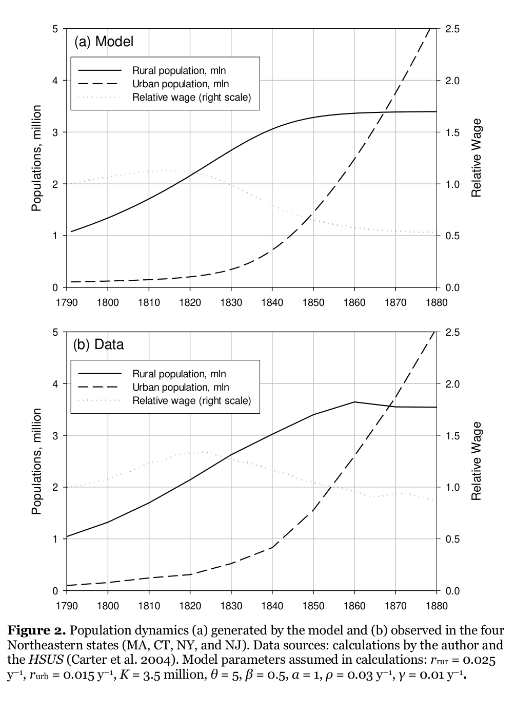

- **What it shows**: Two-panel comparison — (a) model-generated, (b) observed trajectories for rural pop., urban pop., and relative wage in 4 NE states (MA, CT, NY, NJ), 1790–1880
- **Key data points**: Rural pop. saturates ~3.5M (carrying capacity K); urban pop. grows exponentially from ~0.1M; w rises until ~1820 then declines as labor supply overtakes demand
- **Connection to argument**: Validates demographic model (Eqs. 6–7); demonstrates wage reversal mechanism — shift from labor scarcity to oversupply ~1820 as rural pop. → K

### Figure 3: Elite Dynamics — Antebellum Model

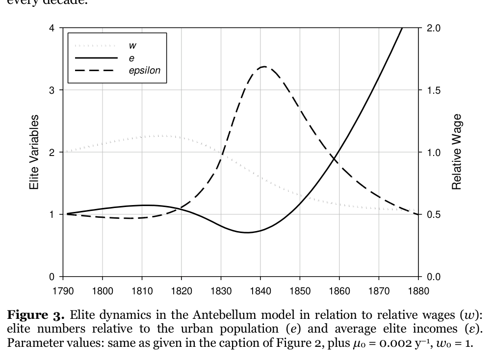

- **What it shows**: Trajectories of w, relative elite numbers (e), and ε, 1790–1880
- **Key data points**: e ≈ 1% until 1840, then 3× to ~3% by 1870; ε rises until 1840, then declines as e dilutes surplus
- **Connection to argument**: Core destabilizing mechanism — ~20yr lag between w↓ (starting ~1820) and elite explosion (starting ~1840); ε peaks before dilution by growing e

### Figure 4: Youth Cohort Proportion — Empirical

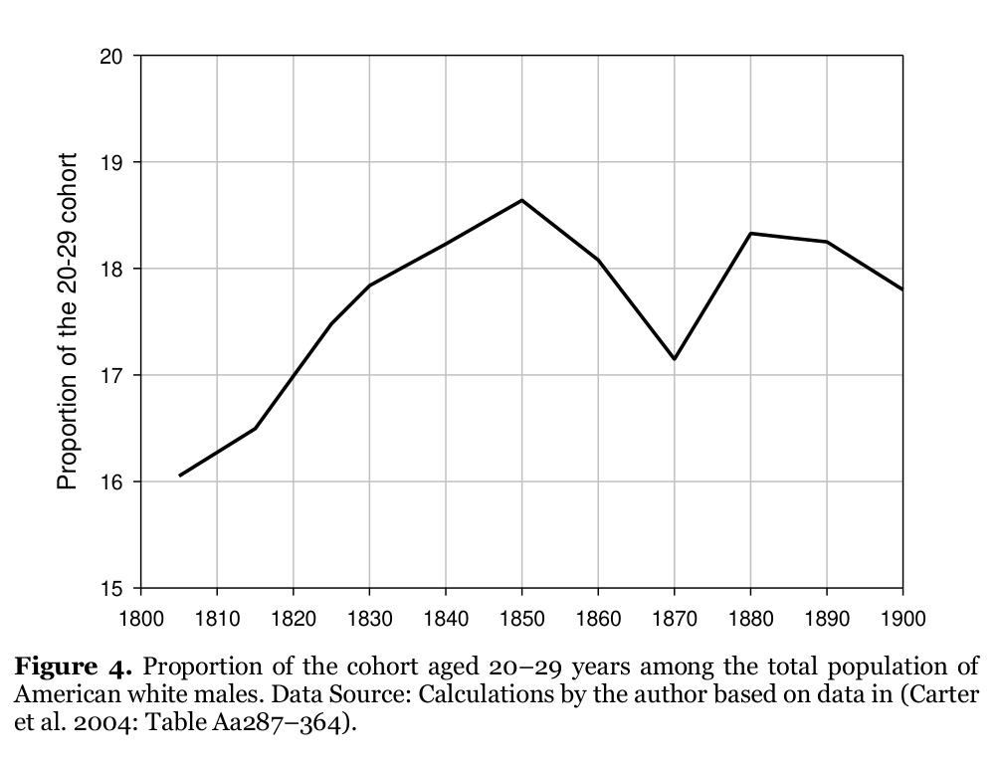

- **What it shows**: A₂₀₋₂₉ (proportion of 20–29yr cohort among white males), 1800–1900
- **Key data points**: Fluctuates 15–19%, peaks ~1810 and ~1860
- **Connection to argument**: A₂₀₋₂₉ component of MMP; used as empirical input (exogenous), not modeled

### Figure 5: MMP and EMP — Antebellum Model

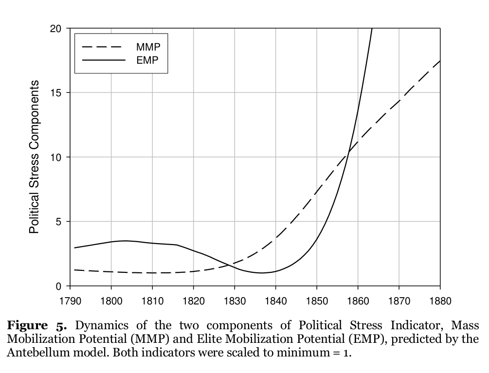

- **What it shows**: Predicted MMP and EMP (both scaled to min=1), 1790–1880
- **Key data points**: MMP flat until 1820, then steady growth; EMP declines until 1830s, then explodes (~18× minimum by 1870)
- **Connection to argument**: EMP more violent in amplitude and phase-shifted vs. MMP — elite overproduction is the more explosive pressure source

### Figure 6: Predicted PSI vs. Observed Instability — Antebellum

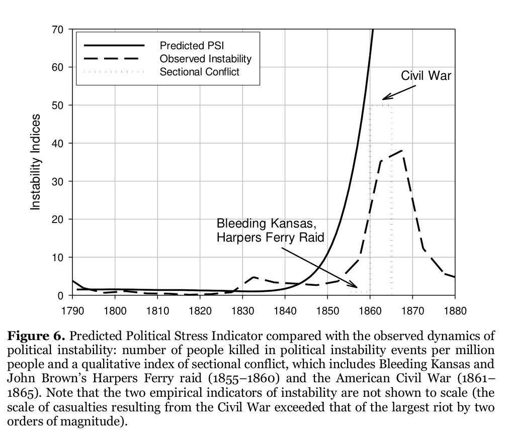

- **What it shows**: Model PSI overlaid with observed political instability (casualties/million) and sectional conflict index, 1790–1880
- **Key data points**: PSI low until ~1840, explodes 1850s; observed escalation (Bleeding Kansas 1855, Harper's Ferry 1859, Civil War 1861–65) follows PSI with short lag
- **Connection to argument**: Core validation — PSI as leading indicator of both small-scale violence and eventual civil war

### Figure 7: Labor Demand vs. Supply — Contemporary US

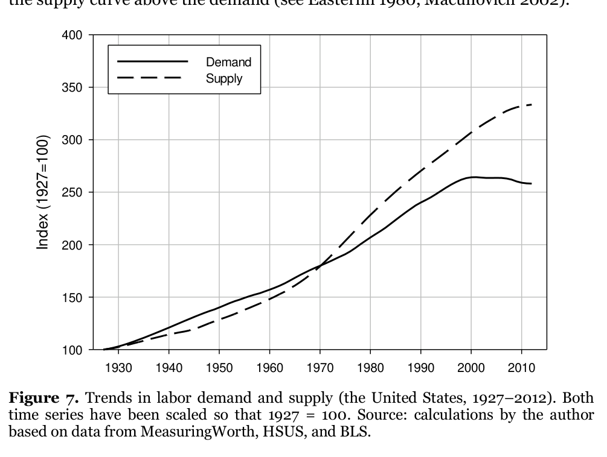

- **What it shows**: Labor demand (G/P = GDP÷productivity) vs. supply (total labor force), both indexed to 1927=100, 1927–2012
- **Key data points**: D > S until ~1965; S crosses above D late 1960s (baby boomers + immigration); D plateaus post-2000 (sluggish growth + productivity gains)
- **Connection to argument**: Structural mechanism for post-1970 wage stagnation — D/S reversal driven by demographic growth + immigration policy

### Figure 8: Union Dynamics — Coverage and Illegal Firings

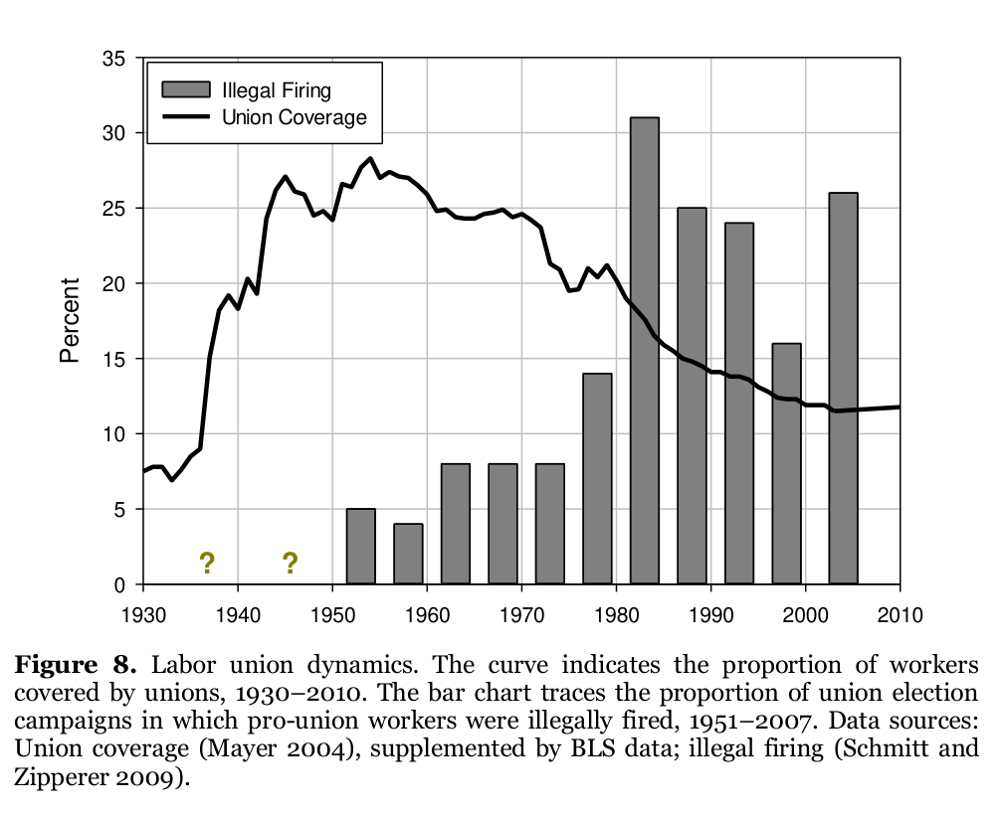

- **What it shows**: Union coverage (1930–2010) and proportion of union campaigns with illegal firings (1951–2007)
- **Key data points**: Coverage peaks >25% (1945–60), declines to ~12% by 2010; illegal firings during drives increase ~10× between 1950s and 1980s
- **Connection to argument**: Empirical evidence for cultural shift (non-market forces C) — transformation from New Deal labor-management compact to anti-union corporate strategy, esp. 1970s

### Figure 9: Real Minimum Wage — Proxy for Non-Market Forces

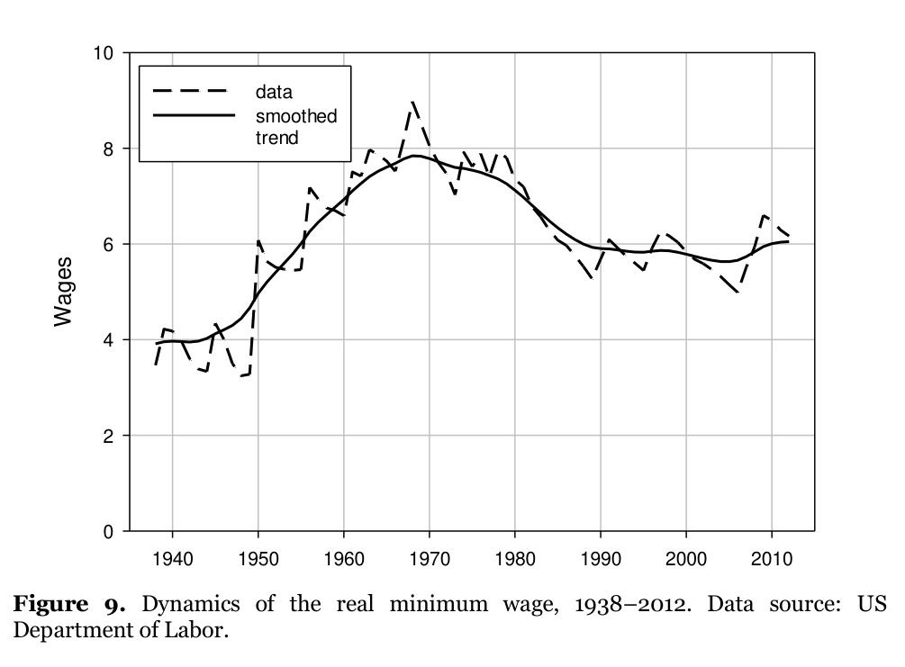

- **What it shows**: Real (inflation-adjusted) minimum wage, 1938–2012
- **Key data points**: Steady rise New Deal → Great Society (2× over 1950–1970); declines post-1970 (inflation erosion without increases); lower equilibrium 1990s–2000s
- **Connection to argument**: Proxy variable for C in regression model; trend tracks broader institutional shift in labor-management relations

### Figure 10: Progressive Regression Fits — Contemporary Wages

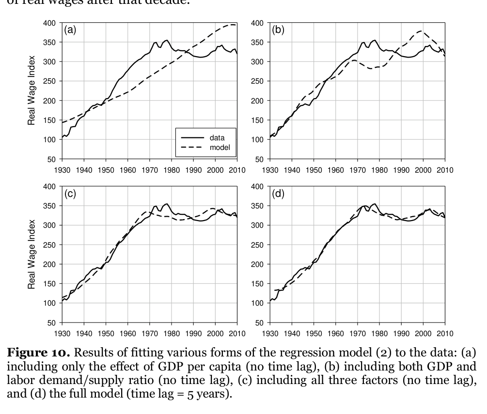

- **What it shows**: Four panels — regression fits with progressively more factors: (a) GDP/capita only, (b) +D/S, (c) +C (all three), (d) full model with 5yr lag
- **Key data points**: R² = 0.73 → 0.93 → 0.98; 5yr lag captures fine-scale fluctuations (1980s dip, 1990s rise, post-2000 decline)
- **Connection to argument**: All three structural determinants needed; 5yr lag reflects real institutional adjustment delays, not just fitting device

### Table 1: Regression Analysis Results

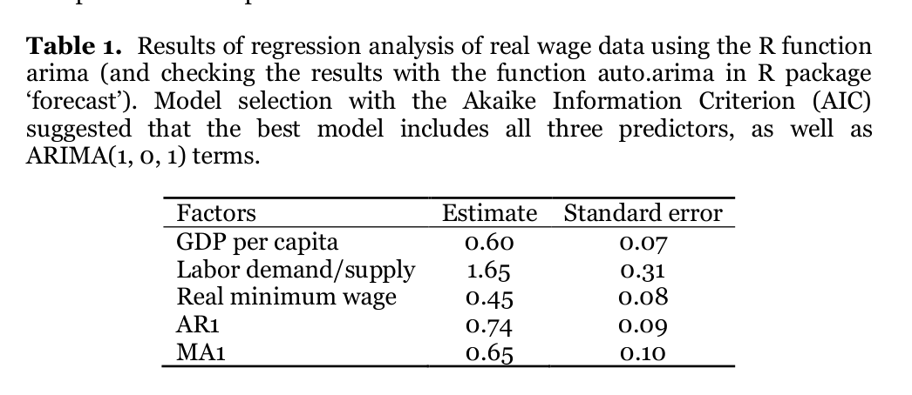

- **Key findings**: All predictors significant: GDP/capita α=0.60±0.07, D/S β=1.65±0.31, min. wage γ=0.45±0.08. ARIMA(1,0,1) error: AR1=0.74, MA1=0.65. AIC confirms all three needed.

### Figure 11: Elite Submodel Dynamics — Contemporary US

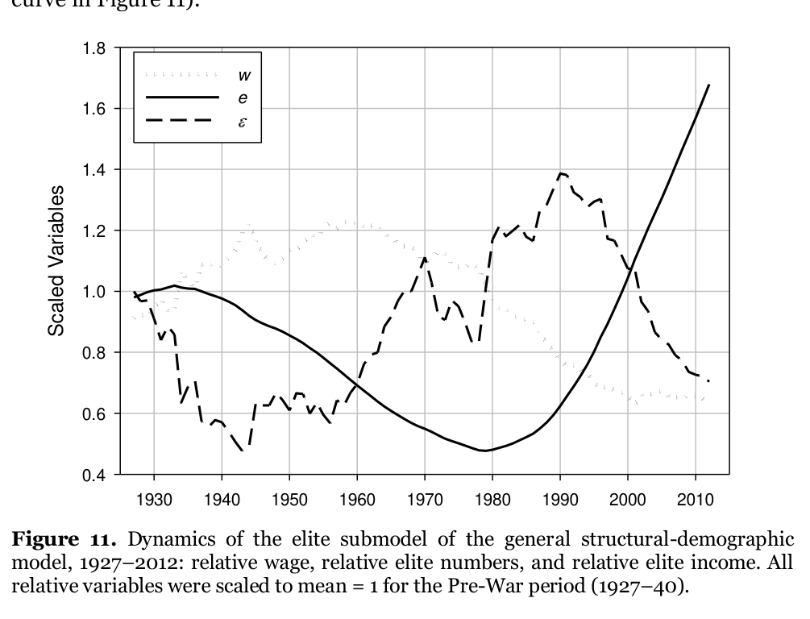

- **What it shows**: Model-predicted w, e, and ε trajectories, 1927–2012
- **Key data points**: w peaks ~1960, steep decline post-1978; e declines gently 1930–1980, then ~3× post-1980; ε recovers post-1955, peaks ~1990, then declines as expanding e dilutes surplus
- **Connection to argument**: Same qualitative dynamics as Antebellum (cf. Figure 3) — w↓ precedes elite explosion by ~20yr; ε eventually diluted by growing e

### Table 2: Millionaire Proportions, 1983–2007

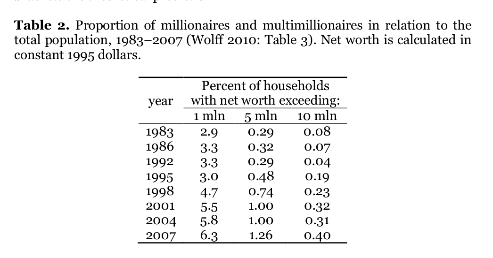

- **Key findings**: Households >$1M net worth: 2.9% → 6.3%; >$5M: 0.29% → 1.26%; >$10M: 0.08% → 0.40%. Expansion rates bracket model's predicted elite growth.

### Table 3: Congressional Candidates, 2000–2012

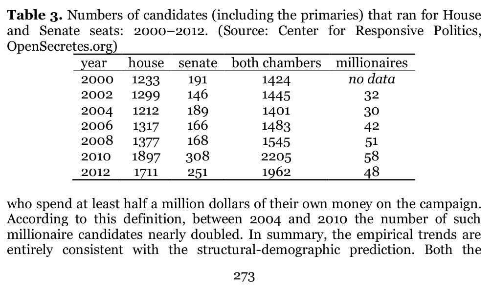

- **Key findings**: House candidates 1,233 → 1,897 (+54%); Senate 191 → 308 (+61%). Self-funded millionaire candidates ~2× (30 → 58, 2004–2010).

### Figure 12: Cost of Winning House Election, 1986–2012

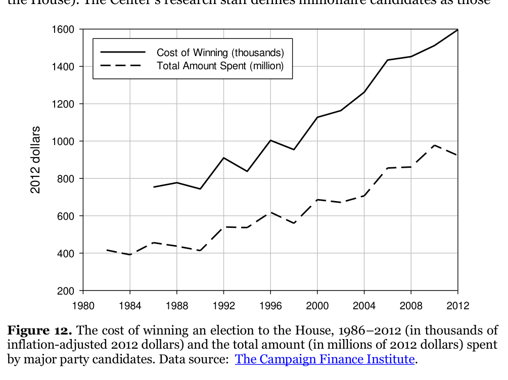

- **What it shows**: Inflation-adjusted cost of winning House seat (thousands) + total major party spending (millions), 1986–2012
- **Key data points**: Cost of winning ~2× ($800K → $1.6M); total spending → ~$1B by 2010
- **Connection to argument**: Direct evidence of intensifying intraelite competition for political positions — predicted consequence of elite overproduction

### Figure 13: National Debt/GDP and Government Distrust

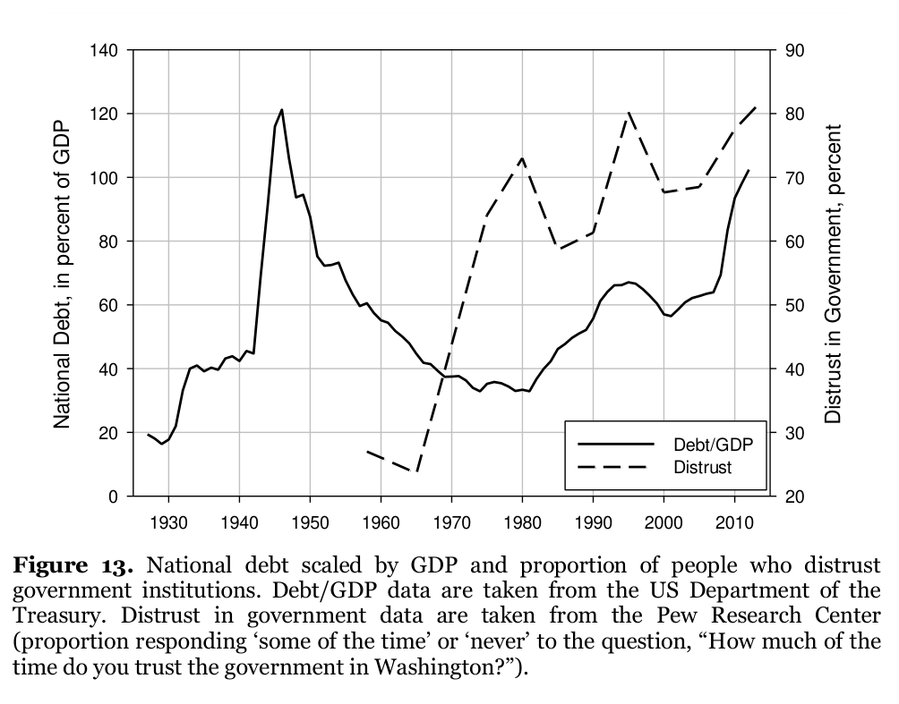

- **What it shows**: Debt/GDP (%) and proportion distrusting government, 1930–2012
- **Key data points**: Debt/GDP: WWII spike → decline to ~30% by 1980 → unprecedented peacetime growth to ~100% by 2012. Distrust: 20–30% (late 1950s/60s), Watergate damage, cyclically escalating (each peak > last, reaching ~80% by 2011)
- **Connection to argument**: Two SFD components; joint elevation post-2000 completes PSI trifecta (MMP + EMP + SFD all rising)

### Figure 14: Estimated PSI, 1958–2012

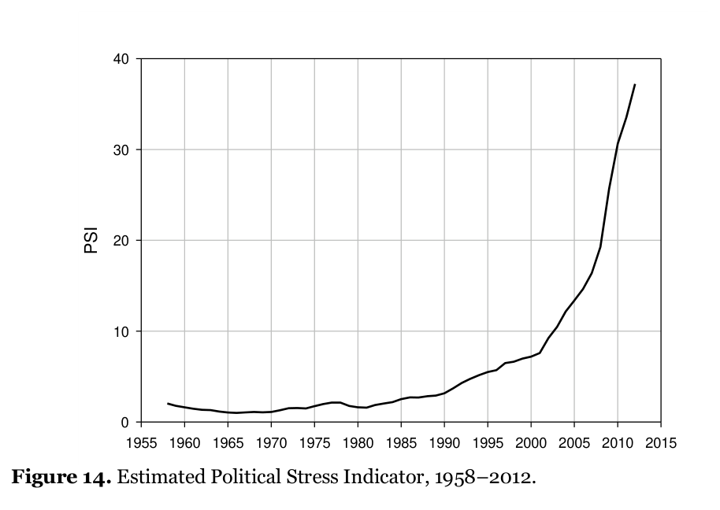

- **What it shows**: Calculated PSI for contemporary US
- **Key data points**: PSI ≈ 0 through 1960s–80s; rises post-1980; sharp acceleration post-2000; reaches ~40 by 2012 (from ≈0 in 1960)
- **Connection to argument**: Contemporary PSI trajectory parallels antebellum; structural conditions as of 2012 favor continued increase through ≥2020

Note: Each image reference (``) embeds the rendered page for visual inspection by future sessions. The textual decomposition provides searchable, quotable content and serves as alt-text. Both are required.

**Figure storage convention**: Rendered figures saved in `figures/Turchin-2013-SocialPressures/`. File naming: `{type}_{NN}_p{P}.png` — e.g., `fig_02_p16.png` (Figure 2, page 16), `tab_03_p34.png` (Table 3, page 34). Fallback: `page_{P}.png` (full-page render for text-only tables). Extraction script also writes `_manifest.json` listing all items.

## Figure ↔ Concept Contrast

- Figure 1 → **PSI**, **MMP**, **EMP**, **SFD**: Schematic overview of structural-demographic model — three compartments (Population, Elites, State) with causal feedback via relative wage (w)
- Figure 2 → **w**: Rural-urban migration creates labor oversupply → wage reversal initiating instability cycle
- Figure 3 → **Elite overproduction**, **ε**: Core mechanism — ~20yr lag between w↓ and elite explosion; ε peaks then diluted by growing e
- Figures 5, 6 → **PSI**, **MMP**, **EMP**: Multiplicative amplification (EMP × MMP); PSI validated as leading indicator
- Figure 7 → **D/S**: Structural crossover ~1965 driving post-1970 wage stagnation (contemporary analog of antebellum migration pressure)
- Figures 8, 9 → **C**: Institutional transformation from labor-protective → capital-protective norms (union decline + min. wage erosion)
- Figure 10 → **τ**: Progressive fitting: 5yr lag captures real institutional delays; all three factors needed (R² 0.73 → 0.93 → 0.98)
- Figure 11 → **Elite overproduction**, **μ**: Contemporary dynamics recapitulate antebellum with ~20yr lag between w↓ and elite explosion
- Figure 12, Tables 2–3 → **EMP**: Direct measures of intensifying intraelite competition (office cost, candidate proliferation, millionaire candidates)
- Figure 13 → **SFD**: Both components (debt/GDP, distrust) elevated post-2000 → structural trifecta complete
- Figure 14 → **PSI**: Contemporary trajectory mirrors antebellum; sharply accelerating post-2000

## Equations & Formal Models

### General Real Wage Model (Eq. 1)

$$W_{t-\tau} = a \left(\frac{G_t}{N_t}\right)^\alpha \left(\frac{D_t}{S_t}\right)^\beta C_t^\gamma$$

Three multiplicative factors: GDP/capita (productivity), labor D/S (market), non-market forces (C). Lag τ ≈ 5yr = wage stickiness.

### Log-Linear Form (Eq. 2)

Log-linear form → standard regression with ARIMA errors.

### Elite Population Dynamics (Eqs. 3–4)

$$\dot{E} = rE + \mu N \quad;\quad \mu = \mu_0 \left(\frac{w_0}{w} - 1\right)$$

w < w₀ → μ > 0 (net upward mobility → elite expansion). w > w₀ → μ < 0 (net downward). Relative elite numbers: ė = μ (assuming similar natural growth rates).

### Relative Elite Income (Eq. 5)

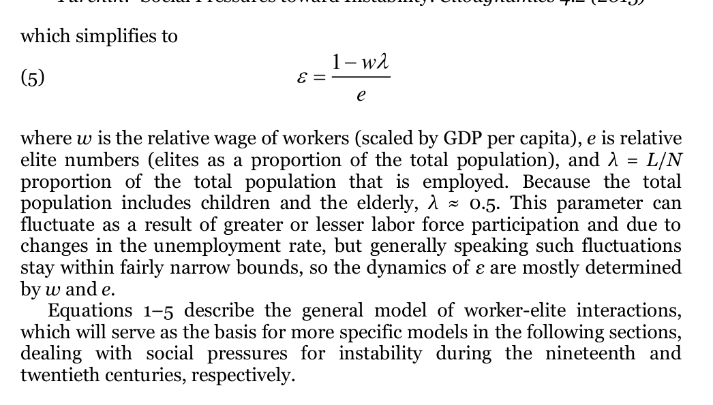

$$\varepsilon = \frac{1 - w\lambda}{e}$$

λ ≈ 0.5 (labor force participation). As e↑ and w↓: numerator (elite GDP share) grows but eventually overtaken by denominator (elite numbers) → income dilution.

### Antebellum Population Model (Eqs. 6–7)

$$\dot{N}_{rur} = rN_{rur} - rN_{rur}\left(\frac{N_{rur}}{K}\right)^\theta \quad;\quad \dot{N}_{urb} = r_{urb}N_{urb} + rN_{rur}\left(\frac{N_{rur}}{K}\right)^\theta$$

Rural pop. → K generates nonlinear migration to cities (θ=5 for sigmoidal response). Urban growth = endogenous (r_urb=1.5%/yr) + rural overflow.

### Antebellum Wage (Eq. 10)

$$w = a\left(\frac{D}{N_{urb}}\right)^\beta$$

Simplified for pure market economy (no C factor): w determined solely by labor D/S.

### PSI (Eq. 14)

$$\Psi = w^{-1} \cdot \frac{N_{urb}}{N} \cdot A_{20-29} \cdot \varepsilon^{-1} \cdot \frac{E}{sN} \cdot \frac{Y}{G} \cdot D$$

Composite index = MMP × EMP × SFD. All structural-demographic pressures → single scalar.

## Theoretical & Methodological Implications

Method: formal-mathematical modeling with empirical calibration. Two distinct approaches per data availability:
- **Antebellum**: ODE system (Eqs. 6–12) calibrated to demographic params → endogenous trajectories for all variables
- **Contemporary**: regression (ARIMA, 3 structural predictors) for wages → fitted w trajectory feeds elite dynamics ODE (Eq. 13) → elite predictions

Advocates spectrum of manageable models over one comprehensive model. Large complex models suffer structural instability (small parameter changes → large dynamical changes). Positions his approach as "dynamically incomplete" — models one variable in detail, treats others as exogenous — yet captures essential causal mechanisms.

Multiplicative PSI is phenomenological (inherited from Goldstone 1991, modified functional forms), not derived from first principles. Interaction effect: all three pressures must be simultaneously elevated; any ≈ 0 suppresses the whole. Asserted as empirically reasonable, not formally justified.

Sharp methodological separation: structural pressures = domain of quantitative modeling; triggers = narrative history. Analogy: forest fire science measures fuel load and moisture (forecastable severity) without predicting which lightning bolt ignites.

Validation: retrodiction (Antebellum PSI consistent with known instability) + genuine prediction (Contemporary forecast first published 2010, before 2010s events). Antebellum methodologically stronger (model not fit to outcome); Contemporary practically more impressive (rare successful 10yr social-science prediction).

## Empirical Data

**Antebellum params**: r_rur=2.5%/yr, r_urb=1.5%/yr, K=3.5M, θ=5, β=0.5, ρ=3%/yr, γ=1%/yr, μ₀=0.002/yr, w₀=1. Sources: HSUS (Carter et al. 2004).

**Contemporary wage regression**: R²=0.98 (3 factors + 5yr lag). Coefficients: GDP/capita α=0.60±0.07, D/S β=1.65±0.31, min. wage γ=0.45±0.08. ARIMA(1,0,1): AR1=0.74, MA1=0.65. Sources: MeasuringWorth (wages/GDP), BLS (productivity, labor force), Census (demographics).

**Elite overproduction evidence**: Households >$1M: 2.9% → 6.3% (1983–2007). Congressional candidates +54–61% (2000–2010). House seat cost ~2× in real terms (1986–2012). Self-funded millionaire candidates ~2× (2004–2010).

**State fiscal indicators**: Debt/GDP: ~30% (1980) → ~100% (2012) — first peacetime growth of this magnitude. Distrust cyclically escalating: each peak > previous (→ ~80% by 2011, from ~20% in late 1950s).

**Key time series**: D overtaken by S ~1965; w peaked ~1960, declining through 2012; union coverage peaked ~25% (1945–60), → ~12% by 2010; real min. wage 2× (1950–70), then eroded to lower equilibrium.
