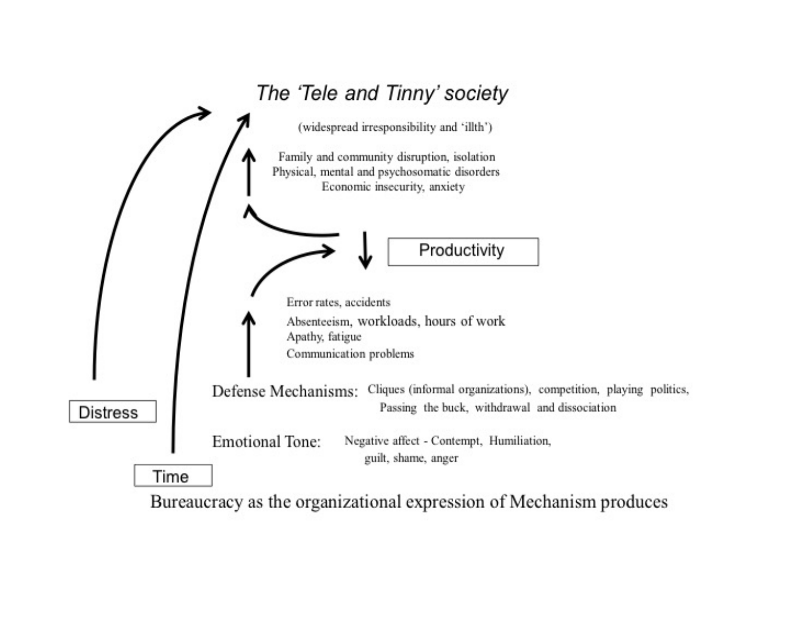
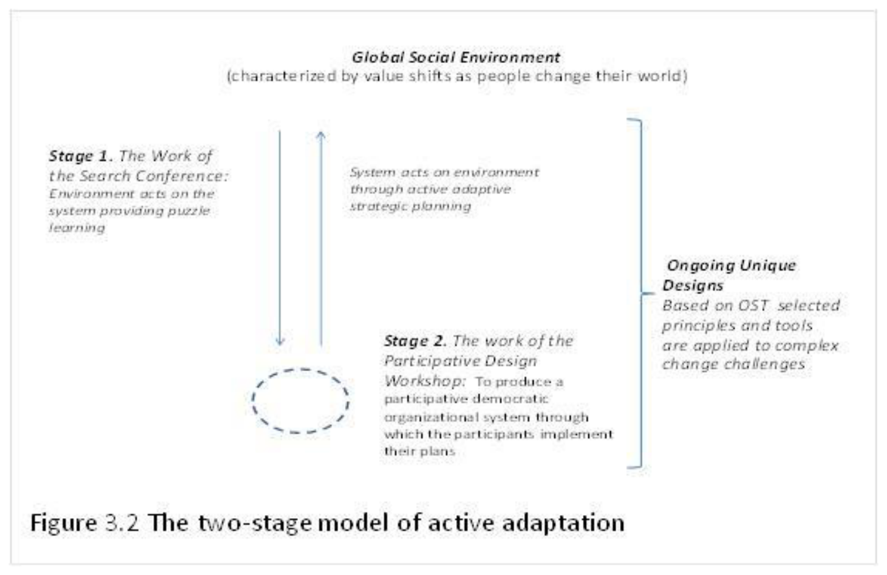
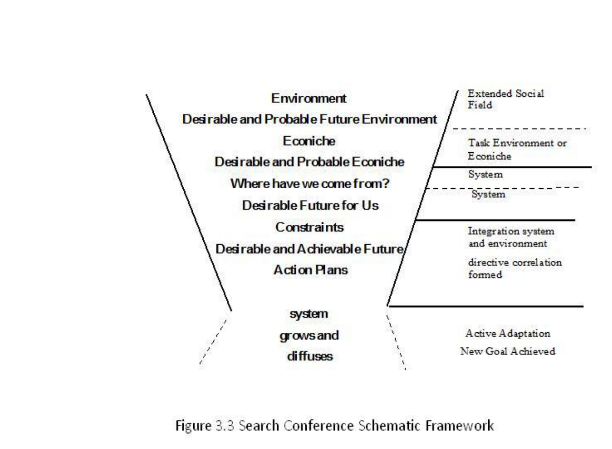
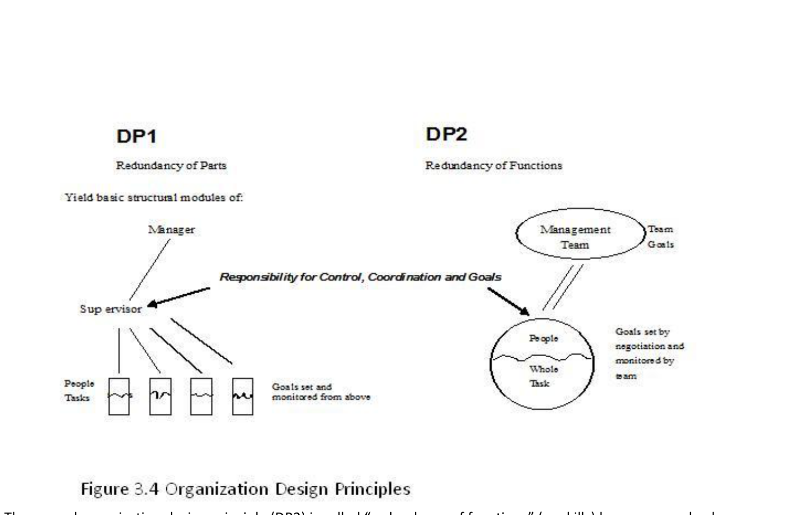

# de Guerre (2016) — Open Systems Theory and the Two-Stage Model of Active Adaptation — Distillation

> Source: Donald W. de Guerre, "Open Systems Theory and the Two-Stage Model of Active Adaptation," chapter in practitioner anthology, 2016. 9 pages.
> Date distilled: 2026-03-03
> Distilled by: Claude (via distill skill)
> Register: practitioner-applied
> Tone: mixed (personal "we" framing + impersonal theory exposition)
> Density: accessible-general

## Core Argument

OST(E) — Open Systems Theory in Fred Emery's formulation — treats the "system-in-environment" as the irreducible unit of analysis and design. The socioecological starting point (people-in-environment) entails that organizational pathology and health are structural products of design principles, not properties of individuals. DP1 (bureaucratic hierarchy, redundancy of parts) is perfectly designed to produce the outcomes it produces: deskilling, defense mechanisms, dissociation, and the cascading societal degradation Emery called the "Tele and Tinny" society. This cascade is irreversible under its own dynamics — DP1 does not self-correct.

The two-stage model of active adaptation provides the structural intervention. Stage 1 (Search Conference) scans the system-environment relationship over time, narrowing from broad environmental awareness through econiche analysis to specific action plans — eliciting ideal-seeking behavior and community-level alignment. Stage 2 (Participative Design Workshop) restructures the organization from DP1 to DP2 (redundancy of functions), with workers as their own designers. The sequence is essential: environment first, then structure. DP2 yields self-managing groups where coordination responsibility lies with the people doing the work, the six intrinsic motivators are satisfied, and learning is continuous.

A 300-employee mine case study demonstrates the model at scale: 4 SCs → 8 strategic themes → 11 PDWs → 44 proposed designs → 3 basic themes → 1 rejected (non-DP2) → town hall consensus on Design A (27/31 groups). The process was not an intellectual engineering exercise but a political and emotional one involving "painful learning" at individual, team, and organizational levels. Organizations are perfectly designed to deliver what they do — the choice of design principle is the fundamental organizational decision.

## Key Concepts

| Concept | Definition | Significance |
|---------|-----------|--------------|
| OST(E) | Open Systems Theory (Emery variant): socioecological systems theory where the unit of analysis is always system-in-environment | Foundational framework; all other concepts derive from this ontological commitment to system-environment indivisibility |
| Two-stage model | SC (Stage 1) + PDW (Stage 2) = complete active adaptive planning process | The operationalization of OST(E) into a practitioner methodology; environment-first sequence is essential |
| Search Conference (SC) | Stage 1: participative community-building event that examines system-in-environment over time, producing strategic direction through ideal-seeking behavior | Addresses system↔environment alignment; funnel structure narrows from broad environmental scan to specific action plans |
| Participative Design Workshop (PDW) | Stage 2: organization redesign process where workers (not consultants) restructure their own work from DP1 → DP2 | Addresses internal organizational structure; three phases (analysis, redesign, practicalities); transfer of design knowledge to participants |
| DP1 (Design Principle 1) | Redundancy of parts: bureaucratic hierarchy where work is controlled ≥1 level above where done; people are interchangeable parts | Genotypical principle yielding hierarchy of personal dominance; produces the Tele and Tinny cascade over time |
| DP2 (Design Principle 2) | Redundancy of functions: participative democratic structure where people carry multiple skills and self-manage; coordination internal to work group | Genotypical principle yielding flat hierarchy of functions; satisfies six intrinsic motivators; jointly optimized sociotechnical system |
| Tele and Tinny society | End-state of sustained DP1: dissociated, superficial society where passive consumption replaces active citizenship | Named for television + tinned food; irreversible cascade: DP1 → negative affect → defense mechanisms → productivity loss → societal harm → reinforced DP1 |
| Six intrinsic motivators | Adequate elbow room, learning opportunity, optimal variety, mutual support/respect, meaningfulness, desirable future | Emery's criteria for productive human activity; present under DP2, degraded under DP1; diagnostic tool in PDW Phase 1 |
| Active adaptation | Proactive planning to improve the environment (person, planet, profit), not passive reaction to environmental change | Distinguishes OST(E) from reactive adaptation; the system acts on its environment, not merely within it |
| Rationalization of conflict | Process for surfacing structural conflicts and making common ground explicit rather than suppressing disagreement | Essential SC characteristic; distinct from both suppression (DP1) and avoidance (laissez-faire) |
| Diffusion | SC characteristic: implementation includes spreading goals and underlying ideals beyond participants into the wider system | Without effective diffusion, strategic planning remains isolated; diffusion makes SC a systemic intervention |
| Genotypic / phenotypic | Design principles (DP1/DP2) are genotypic (structural invariants); local implementations are phenotypic (contextual variations) | No prescriptive organizational template; DP2 specifies a principle, not a blueprint |
| Organizational choice | Recognition that organizations are perfectly designed to deliver what they do; the choice of design principle is fundamental | Core OST(E) legacy; pathology is structural output, not implementation failure or individual character |
| Socioecology | People-in-environment as the unit of analysis; if social environment is hierarchical, changing it to participative creates healthier outcomes | Grounds OST(E)'s interventionist stance; environmental structure determines human outcomes |

## Figures, Tables & Maps

### Figure 3.1: The Tele and Tinny Society

- **What it shows**: Cascading pathological spiral produced by DP1/bureaucratic organization over time. Arrows flow from DP1 structure through negative emotional tone (contempt, humiliation, guilt, shame, anger) → defense mechanisms (cliques, competition, playing politics, passing the buck, withdrawal, dissociation) → productivity loss (error rates, accidents, absenteeism, workloads, hours of work, apathy, fatigue, communication problems) → the Tele and Tinny society (widespread irresponsibility and "dits," family/community disruption, physical/mental/psychosomatic disorders, economic insecurity, anxiety). Arrows return from Tele and Tinny back to Distress, completing the self-amplifying loop. Time axis runs left-to-right.
- **Key data points**: The cascade has four stages (distress → defense → productivity → societal); feedback arrows create a closed loop showing irreversibility; the Time axis is explicit.
- **Connection to argument**: Demonstrates that DP1 pathology is structural and self-amplifying — the core motivation for the two-stage model intervention.

### Figure 3.2: The Two-Stage Model of Active Adaptation

- **What it shows**: The complete two-stage model. "Global Social Environment" at top (characterized by value shifts as people change their world). Stage 1 (SC): system acts on environment through active adaptive strategic planning. Stage 2 (PDW): produces participative democratic organizational systems through which people actualize their plans. Arrows cycle between stages and the global environment. "Ongoing Unique Designs" at right — OST-selected principles/tools applied to complex change challenges.
- **Key data points**: Two-way arrows between SC output and environment; SC feeds PDW which feeds ongoing designs; environment sits above both stages.
- **Connection to argument**: Visual summary of the complete methodology — environment-first sequence (SC → PDW) producing active adaptive organizations that influence their environment.

### Figure 3.3: Search Conference Schematic Framework

- **What it shows**: Inverted funnel/fishbone. Left side labels narrow from broad to specific: Environment → Desirable and Probable Future Environment → Econiche → Desirable and Probable Econiche → Where have we come from? → Desirable Future for Us → Constraints → Desirable and Achievable Future → Action Plans. Bottom: "system grows and diffuses." Right side maps to OST architecture: Extended Social Field → Task Environment or Econiche → System → Integration system and environment (directive correlation formed) → Active Adaptation / New Goal Achieved.
- **Key data points**: The funnel structure explicitly maps each SC phase to OST theory (Extended Social Field, Task Environment, System, directive correlation, active adaptation). Diffusion is the output at the bottom.
- **Connection to argument**: Shows SC is not ad hoc facilitation but a theoretically grounded scanning sequence — each phase corresponds to a specific OST concept.

### Figure 3.4: Organization Design Principles (DP1/DP2)

- **What it shows**: Side-by-side structural comparison. DP1 (Redundancy of Parts): hierarchical tree — Manager → Supervisor → People/Tasks; goals set and monitored from above; people matched to fragmented tasks. DP2 (Redundancy of Functions): circular arrangement — Management Team at boundary, People + Whole Task in a self-managing circle; Team Goals set by negotiation and monitored by team. Central label: "Responsibility for Control, Coordination and Goals" with arrow showing where this responsibility resides in each structure.
- **Key data points**: DP1 has 3 hierarchical levels (Manager/Supervisor/People); DP2 has 2 functional levels (Management Team/People+Whole Task); the critical shift is WHERE responsibility for control, coordination and goals resides.
- **Connection to argument**: The genotypic structural difference — DP1 locates coordination above the work, DP2 locates it with the workers. All other organizational consequences (six motivators, learning, health) flow from this single structural distinction.

## Figure ↔ Concept Contrast

- Figure 3.1 → **Tele and Tinny society**: The primary visual representation — maps the full cascade from DP1 through defense mechanisms to societal degradation
- Figure 3.1 → **DP1**: Shows the structural consequences of DP1 sustained over time; the spiral IS what DP1 produces
- Figure 3.2 → **Two-stage model**: Direct visual summary of the SC + PDW methodology and its relationship to the Global Social Environment
- Figure 3.2 → **Active adaptation**: The arrows between stages and environment show active (not reactive) system-environment transaction
- Figure 3.3 → **Search Conference (SC)**: Detailed process mapping — each funnel phase corresponds to an OST theoretical concept
- Figure 3.3 → **Diffusion**: The funnel's output explicitly shows "system grows and diffuses"
- Figure 3.3 → **Socioecology**: The right-side labels map each phase to the system-in-environment architecture
- Figure 3.4 → **DP1 / DP2**: Side-by-side structural contrast — the genotypic difference visualized
- Figure 3.4 → **Organizational choice**: Shows the two available structural options — choice between them is the fundamental organizational decision
- Figure 3.4 → **Six intrinsic motivators**: DP2 structure (People + Whole Task, goals by negotiation) creates conditions where the six criteria can be met; DP1 structure (fragmented tasks, goals from above) structurally prevents them

## Theoretical & Methodological Implications

The source employs a practitioner-applied methodology grounded in action research (Emery/Trist tradition). The method is explicitly interventionist — OST(E) does not study organizations from outside but enters them to change their design principle. This positions it against both detached empiricism (studying organizations without changing them) and top-down consultancy (changing organizations without involving workers).

The ontological commitment is socioecological: the system-in-environment is the irreducible unit. This precludes methodological individualism (explaining organizational outcomes from individual properties) and environmental determinism (explaining organizational outcomes from market forces alone). Both person AND environment must be engaged simultaneously — hence the two-stage model.

The genotypic/phenotypic distinction is methodologically significant: DP1 and DP2 are not ideal types or endpoints on a continuum but discrete structural principles. An organization is genotypically DP1 or DP2 — there is no intermediate form. Local implementations vary (phenotypic diversity), but the underlying principle does not. This yields a binary diagnostic: identify which design principle governs coordination, and the organizational consequences follow.

The case study method is participant-observational: de Guerre was involved in the mine redesign as practitioner-researcher. The 300-employee, 4-SC, 11-PDW, 44-design sequence is presented as evidence of the two-stage model's scalability and the emergence of organizational consensus through distributed participative process.
